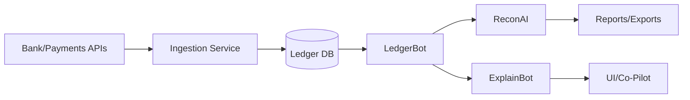

# OpportunityOS — Product Requirements Document (PRD)

**Product:** OpportunityOS (Global Accounting SaaS)  
**Version:** 2.0  
**Date:** 2025-10-06  
**Owner:** Product Strategy & AI Systems Team  
**Brand Palette:** Gold `#D4AF37`, Black `#0D0D0D`, White `#FFFFFF`  
**Status:** Final Draft for Executive & Engineering Review

---

## 1) Executive Summary

OpportunityOS is a mobile-first, AI-powered accounting platform for SMBs, accountants, and global startups. It replaces rules-only automations with **agentic workflows** that reconcile, categorize, and report with human-in-the-loop oversight. Core advantages: autonomous reconciliation, explainable actions, multi-currency + tax intelligence, and developer-friendly integrations.

**Primary Launch Goal:** Ship an MVP that automates =85% of day-to-day bookkeeping with =98% accuracy across initial regions (US, EU, PH, JP), while demonstrating reliable bank feeds and one-click reconciliation. The default dashboard mirrors the industry-standard QuickBooks Online (Business overview) layout and terminology for familiarity and reduced training time.

---

## 2) Competitive Context (Snapshot)

**QuickBooks Online:** strong ecosystem, rules-based automations; pain points: UI churn, bank-feed reliability, rising costs for advanced features.

**Xero:** clean UX and partner network; gaps around deeper automation and certain multi-currency scenarios.

**Zoho Books:** value-packed, integrated suite; gaps in advanced workflows and some regional tax depth.

**FreshBooks:** freelancer-focused simplicity; limited automation depth and reporting flexibility.

**Wave:** free core features; limited scale features and trust/support concerns for some users.

**Fiskl:** mobile-first simplicity; gaps in accountant collaboration and some integrations at scale.

### Opportunity

Deliver **true workflow automation** (agentic reconciliation, anomaly detection, explainable posting) with **global compliance** and **premium yet simple** UX.

---

## 3) Objectives & Success Metrics

### 3.1 Objectives

- Deliver MVP modules: **GL, Bank Feeds, OCR Expenses, Invoicing, Reconciliation, Reports, AI Co-Pilot, FX & Tax presets**.
- Prove agentic value: **one-click reconciliation** with explainable reasoning + confidence thresholds.
- Enable **multi-tenant accountant workspace** and **migration importers** (CSV, QBO/Xero starter).

### 3.2 KPIs

| KPI | Target |
|---|---|
| Automation coverage | ≥ 85% |
| Categorization/recon accuracy | ≥ 98% |
| Monthly close time | ≤ 2 hours |
| P95 dashboard latency | < 2s |
| NPS (post-GA) | ≥ +70 |
| Uptime | 99.9% |

---

## 4) Users & Use Cases

### 4.1 Personas

**Freelancer/Micro-SMB:** quick invoicing, receipt scanning, basic reports.

**SME Owner/Manager:** cash visibility, fast close, team roles.

**Bookkeeper/Accountant:** multi-client workspace, bulk actions, audit logs.

**Startup CFO/Controller:** forecasting, dashboards, compliance exports.

### 4.2 Jobs-to-Be-Done

- "As a business owner, I want bank transactions **auto-categorized** so I stop doing manual data entry."
- "As an accountant, I want **reliable reconciliation** and a clear **audit trail** for reviews."
- "As a CFO, I want **real-time P&L/CF** and **anomaly alerts** to act quickly."

---

## 5) Scope

### 5.1 In-Scope (MVP / P0)

- **General Ledger & Chart of Accounts** (industry/region templates)
- **Bank Feeds** (Plaid, Wise) + ingestion queue + retry/fallback
- **OCR Expenses** (mobile/web), receipt → expense → tax
- **Invoicing & Payments** (Stripe/PayPal matching)
- **Reconciliation Engine** (one-click **ReconAI**)
- **Reports:** P&L, Balance Sheet, Cash Flow (+ CSV/PDF export)
- **AI Co-Pilot** (chat + actions; explainability)
- **Multi-currency (FX)** & **regional tax presets** (US/EU/PH/JP)
- **RBAC**, accountant multi-tenant workspace
- **Migration importers** (CSV + QBO/Xero starter)

### 5.2 Near-Term (P1)

- Anomaly detection, forecasting
- Integrations marketplace v1 (Shopify, Woo)
- Approvals workflow, journal lock/close
- Report builder (custom columns, groupings)
- QBO/Xero importer deepening
- Parity for QBO-style hubs and lists (Customers/Vendors, Sales Transactions, Bills/Bill payments, Bank Transactions UI, Rules, Receipts Inbox, Reconcile, Bank Deposits, Recurring, Account Register)
- Projects, Tags, Classes/Locations, Customer Statements & Collections Center
- Payroll connectors (Gusto read-only with journal posting)

### 5.3 Out-of-Scope (MVP)

- Full payroll engine (connectors only)
- Advanced inventory/warehousing
- Bank vs Books variance: drill from Bank accounts tile to current Reconcile session or to Recon exceptions for the account/period
- All jurisdictions e-filing (focus pilot regions first)

---

## 6) Functional Requirements

### 6.1 Ledger & Transactions

- Double-entry; accrual basis baseline; cash view toggle
- COA templates by industry + region; COA editor
- CRUD for journals; attachments; **immutable audit log** per action

### 6.2 Bank Feeds

- Connect accounts; nightly + on-demand sync; webhooks
- Idempotent ingestion; de-duplication; retry on failure; **clear error surfacing**
- Feed health metrics per account (lag, errors, last sync)
  
#### 6.2.1 Bank UX (QBO-style)
- Bank Transactions UI: tabs (For review, Categorized, Excluded); row actions (Add, Match, Split, Transfer, Exclude); batch accept; filters; side-panel "Create rule from this"
- Rules: list with priority and on/off; rule editor with conditions builder; import/export CSV template
- Receipts Inbox: upload/email-in/capture; OCR; match to transactions; create expense/bill; archive
- Reconcile UI: start screen, two-column list, difference must be zero; history & reports; undo last reconciliation
- Bank Deposits: select Undeposited funds payments; fees/cash back; deposit slip
- Recurring transactions: templates for invoices, bills, expenses, checks, journal entries
- Account Register: per-account register with reconciled flag

### 6.3 Categorization (**LedgerBot**)

- ML classification using description, merchant, history, vendor
- **Confidence threshold** setting per workspace; auto-post ≥ 0.90; else queue for review
- Inline **"Why?"** with features used and history references
- Bulk review/approve; smart suggestions

### 6.4 Reconciliation (**ReconAI**)

- Automated matching across bank ↔ ledger ↔ payments
- Tolerance rules (FX, rounding); partial match handling; difference posting (with reason)
- **One-click approve**; reconciliation report with exceptions list

### 6.5 Expenses & OCR

- File/Camera upload; multi-page PDF; auto-crop/deskew
- Extract vendor, date, total, tax, currency; line-item optional
- Map to expense + tax codes; duplicate detection; receipt-to-entry link

### 6.6 Invoicing & Payments

- Templates; line items; discounts; taxes; multi-currency
- Payment links (Stripe/PayPal); auto-match receipts
- Dunning emails; **predictive reminder schedule**
  
#### 6.6.1 Sales UX (QBO-style)
- Invoices list KPIs (unsent/overdue/open/paid 30d); quick actions (receive payment, send reminder)
- Estimates (send/accept/convert), Receive payments (deposit to bank/undeposited funds)
- Sales receipts, Credit memos, Refund receipts, Payment links
- Sales Transactions list; Products & Services with CSV import

### 6.7 Reports

- P&L, BS, CF; filters by period, dimension, currency
- Drill-down to source entries and attachments
- Scheduled delivery; CSV/PDF; narrative summary (**ReportGen**)
  
#### 6.7.1 Reports Center (QBO-style)
- Library with favorites and management report packs; presets for Class/Location/Tags reports; drill-down preserved

### 6.8 AI Co-Pilot

- Natural-language queries to actions: "reconcile October," "show Q3 P&L," "flag unusual spend"
- Guardrails: RBAC-aware; confirmation for postings; **dry-run previews**
- Context shortcuts (selected transactions → "Explain" / "Re-classify")


### 6.9 QBO-style Hubs & Pages
- Customers/Vendors hubs with KPI strips and quick actions
- Sales pages: Invoices, Estimates, Receive payments, Sales receipts, Credit memos, Refund receipts, Sales Transactions, Payment links, Products & Services import
- Purchases pages: Bills, Bill payments, Expenses, Purchase orders, Checks
- Reports Center presets for Class/Location/Tags; Statements & Collections Center
- Projects, Mileage, Tags, Classes/Locations
- Payroll (connectors): Gusto (P1), ADP/Justworks (P2) with journal posting and liabilities

### 6.10 Collaboration & Roles

- Roles: Owner, Admin, Accountant, Staff, Viewer
- Client switcher for accountants; task assignments; comments
- Close/lock periods, approval trail; exportable audit pack

### 6.11 Payroll (Connectors)
- Providers: Gusto (P1), ADP/Justworks (P2); OAuth + webhooks
- Account mapping UI: wages expense, employer taxes, employee withholdings (liabilities), benefits (employer vs employee), garnishments liabilities; payroll clearing; cash/bank
- Per-employee allocations: default class/location/department; optional percent splits; validate totals
- Direct deposit clearing: post to clearing then auto-clear to bank on feed match
- Reports: Payroll summary; wages by class/location/department; liabilities; benefits/deductions


---

## 7) Non-Functional Requirements

| Category | Requirement |
|---|---|
| Performance | P95 < 2s dashboard; < 4s report gen (≤ 50k tx range) |
| Scalability | 1M tx/day/cluster; horizontal scale |
| Availability | 99.9% |
| Security | SOC2, GDPR; MFA; RLS; KMS |
| Privacy | Data residency: US/EU/APAC buckets |
| Auditability | Immutable logs for user/AI actions |
| Accessibility | WCAG 2.1 AA |
| Localization | i18n (EN at GA; JP/ES/FR post-GA) |

---

## 8) Architecture

### 8.1 Stack

- **Frontend:** Next.js + TypeScript + React Query; PWA; i18n
- **Backend:** Supabase/Postgres; worker queues; event bus
- **AI Layer:** OpenAI SDK + LangGraph (agents: LedgerBot, ReconAI, InsightAI, ReportGen, TaxAI, ExplainBot)
- **Automation:** n8n; cron; feature flags
- **Storage:** Supabase Storage / S3; signed URLs
- **Observability:** PostHog, Sentry, Grafana/Prometheus

### 8.2 Data Flow



---

## 9) Data Model (High-Level)

**Entities:** Organization, User, Role, ClientWorkspace, Account, Transaction, JournalEntry, Vendor/Customer, Invoice, Payment, Receipt, TaxCode, FxRate, ReportRun, AuditLog.

**Keys:** tenant_id on all rows; composite unique keys for external ids to prevent duplicates.

**Indexes:** date, account_id, amount, external_ref.

**Retention:** configurable per tenant; legal hold support.

---

## 10) AI / Agentic Design

### 10.1 Agents

| Agent | Purpose | Triggers | Autonomy |
|---|---|---|---|
| LedgerBot | Categorize/post | Ingestion, upload | Confidence-gated |
| ReconAI | Match & reconcile | Nightly/on-demand | One-click approve |
| InsightAI | Detect anomalies | Continuous | Notify only |
| ReportGen | Summaries/reports | Scheduled/request | Read-only |
| TaxAI | Apply taxes | Posting time | Rules + alerts |
| ExplainBot | "Why?" answers | On click | Read-only |

### 10.2 Guardrails

- Confidence thresholds; dry-run previews; role-based approvals
- Full action provenance: inputs, model version, decision rationale
- Canary cohorts before expanding autopost

### 10.3 Evaluation

- Weekly accuracy audits; synthetic and real eval sets
- Drift detection on classification distributions
- Rollback to last good model if accuracy drops > 1.5 pp

### 10.4 Safe Mode & AI Health
- Per‑agent and per‑tenant kill switch with audit; canary cohorts for auto‑post
- AI Health dashboard: auto‑post coverage, false‑pos/neg, rule vs AI mix, drift status, model versions; alerts on thresholds

---

## 11) Integrations (Phase 1 Targets)

| Category | Providers |
|---|---|
| Bank Feeds | Plaid, Wise |
| Payments | Stripe, PayPal |
| Commerce | Shopify (orders/invoices) |
| Payroll | Gusto (read totals) |
| Migration | CSV, QBO, Xero |

---

## 12) UX & Design System

**Components:** Untitled UI; 12-col grid (1200px); 24px gutters; section spacing 120px.

**Modes:** Light/Dark; Gold accents; accessible contrast.

**Patterns:** Empty-states with "Try it now"; inline "Why?"; sticky mobile CTA.

**Key Screens:** Dashboard, Transactions, Reconcile, Invoices, Expenses, Reports, Integrations, Settings, Accountant Workspace.

### 12.1 Dashboard (QBO-style preset)
- Business overview layout (12-col grid): Bank accounts, Invoices owed to you, Profit and loss, Expenses, Sales, Cash flow, Taxes, Get things done, Bills to pay; optional Bill payments tile
- Tile menus: View report/Customize/Remove; drilldowns; skeleton/async loading
- Role-based presets and optional modules (Payroll/Mileage/Projects)
 - Presets: `default_qbo` (exact QBO tiles/order) and `qbo_plus` (default + additional tiles like To deposit, Unbilled, Collections, Inventory health, Payroll tasks, Favorites, KPIs, AI insights, At‑risk, Setup/CTA/Tips)
 - Mobile patterns: KPI strips collapse to chips; tiles stack 1‑column; sticky "Get things done" CTA; charts lazy‑load in viewport

---

## 13) API (Illustrative)

```http
POST /api/v1/transactions/import
POST /api/v1/ledger/post
POST /api/v1/reconcile/run
GET  /api/v1/reports?type=pl&period=2025-Q3
POST /api/v1/copilot/command   // intent->action with dry-run preview
```

**Auth:** OAuth2 + JWT; per-tenant scopes; rate limits per endpoint.

**Webhooks:** transaction.created, reconciliation.completed, report.generated.

---

## 14) Security & Compliance

- **Encryption:** AES-256 at rest; TLS 1.3 in transit
- **Access Control:** RBAC + MFA; device/session policy; IP allowlist (Enterprise)
- **Data Isolation:** RLS per tenant; key management via KMS
- **Compliance:** DPIA (GDPR); vendor DPAs; least-privilege access
- **Incident Response:** Playbooks; breach notification SLA
- **Auditability:** Exportable audit logs (CSV/JSON/PDF) with signatures

---

## 15) Analytics & Telemetry

**Product:** Activation steps (connect bank → first post → first recon), feature adoption, churn reasons.

**AI:** Accuracy vs. confidence, human corrections, anomaly precision/recall.

**Reliability:** Feed error rate, ingestion lag, recon queue depth.

**GTM:** Source/medium attribution; trial → paid funnel.

---

## 16) Testing Strategy

| Layer | Focus | Tools |
|---|---|---|
| Unit | Ledger math, tax calc, FX | Jest/Vitest |
| Integration | Ingestion → Recon → Report | Playwright/Cypress |
| AI Eval | F1, precision/recall, explain rubric | Custom harness |
| Load | 1M tx/day, burst OCR | K6/Locust |
| Security | SAST/DAST, pen test | OWASP ZAP, Burp |
| UAT | 10 accountants/100 SMBs | Beta portal |

---

## 17) Release Plan

| Phase | Timeline | Deliverables |
|---|---|---|
| Beta | Weeks 10–12 | MVP, runbooks, cohorts |
| GA | Q4 2025 | Pricing, docs, support |
| P1 | Q1 2026 | Marketplace, forecasting, approvals |
| P2 | Q2 2026 | Global tax packs, deeper importers |

**Rollout:** Blue/green; feature flags; canary cohorts; metrics-based promotion.

---

## 18) Pricing (Draft)

| Tier | Target | Key Inclusions |
|---|---|---|
| Starter | Freelancers | 1 bank, basic reports |
| Pro | SMEs | Multi-bank, AI Co-Pilot, accountant access |
| Enterprise | Firms | SSO/SAML, data residency, priority support |

---

## 19) Risks & Mitigations

**Bank feed instability:** multi-provider fallback, queue buffering, user alerts.

**AI misclassification:** confidence gates, human review, fast feedback learning.

**Jurisdiction complexity:** modular tax packs, phased rollout, expert validation.

**Security/compliance:** third-party audit, pen tests, incident drills.

**Scope creep:** P0/P1 gating, weekly cut reviews, strict flags.

---

## 20) Acceptance Criteria (MVP Exit)

- P0 modules functional and tested end-to-end
- ≥ 85% automation coverage on pilot ledgers; ≥ 98% accuracy sampled
- Reconciliation completes successfully for ≥ 99% of imported transactions
- Reports tie to ledger; drill-downs accurate; exports correct
- Security review passed; runbooks and dashboards live
- Beta satisfaction ≥ 8/10; critical bugs resolved

### 21) IFRS/GAAP Compliance (Summary)
- COA templates for IFRS and US GAAP; opening balances import (debits=credits)
- Financial statements: P&L, Balance Sheet, Cash Flow (Indirect) with IFRS/US GAAP line mappings
- Trial Balance with balance validation; Statement of Changes in Equity (P1)
- Basis toggle (accrual/cash) propagated to dashboard and reports
- Multi-currency (IAS 21): revaluation entries; presentation-currency translation (P1)
- Bank reconciliation: difference must be zero; history & immutable reports
- Accruals, prepayments, deferred revenue (P1), auto-reversing entries
- Period close: lock/reopen with audit; retained earnings roll-forward; audit pack
- Audit controls: immutable logs and explainability; approvals


---

## 21) Open Questions

- Which e-filing targets first per region (read-only vs submit)?
- Additional bank/payment providers per country priority?
- Final AI usage limits in Starter vs Pro tiers?
- Required industry COA templates at GA?

---

## 22) Appendices

### 22.1 Glossary

**Agentic AI:** multi-agent system with autonomous actions under guardrails.

**Recon:** matching bank ↔ ledger entries.

**RLS:** Row-Level Security.

**DPIA:** Data Protection Impact Assessment.

### 22.2 Decision Log (to maintain)

- **2025-10-06:** Regions at GA (US/EU/PH/JP)
- **2025-10-06:** Autopost confidence threshold = 0.90 (canary first)
- **2025-10-06:** Plaid + Wise as phase-1 feeds

### 6.13 AR/AP Enhancements (Scope Notes)
- AR: credit limits/holds, auto write-off thresholds, cash application rules; Statements & Collections Center; dunning schedules
- AP: multi-step approvals, three-way match (PO–receipt–bill), early-payment discounts, payment runs & remittance advice, AP holds
- Acceptance: AR/AP aging reports tie to GL control accounts; audit trails for holds/approvals/cash application

### 6.14 Inventory (P2) — Accounting Notes
- Perpetual inventory; item costing supports Avg and FIFO
- Landed cost capitalization (freight/duties) allocated by qty/weight/value
- COGS roll-forward: Beg Inv + Purchases (net returns/allowances/discounts) + Freight-in ± Adjustments - End Inv = COGS
- Inventory valuation & COGS report ties to P&L COGS and BS inventory; FIFO uses layers; Avg uses weighted average
- Multi-currency: purchases translated at transaction rate; inventory is non-monetary (no revaluation); FIFO layers retain historical rates
- Acceptance: roll-forward and valuation tie to GL; variances flagged

### 6.15 Financial Analysis & Charts (P1)
- Common-size statements: P&L as % of revenue; Balance Sheet as % of total assets/equity
- Ratio dashboards: Current/Quick, Debt/Equity, Inventory/AR/AP turns, DOH/DSO/DPO, Gross/Operating/Net margins, ROA/ROE
- Variance analysis: Prior vs Current; Budget vs Actual; waterfall drivers; Class/Location/Tag variances
- Trends & seasonality: rolling 12-month charts; forecast overlays & confidence bands
- Heatmaps & cohorts: expense category heatmap; customer revenue cohorts/retention
- Scenario manager: best/base/worst; target tracking
- Acceptance: ratios and common-size computed from report totals with identical filters; variance math correct; charts performant and accessible
