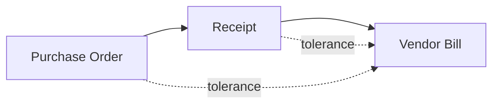

# OpportunityOS — Comprehensive Implementation Tasks

**Version:** 1.0
**Date:** 2025-10-21
**Status:** Implementation Roadmap
**Brand Palette:** Gold `#D4AF37`, Black `#0D0D0D`, White `#FFFFFF`

---

## Table of Contents
1. [Phase 0: Foundation & Setup](#phase-0-foundation--setup)
2. [Phase 1: Core Infrastructure](#phase-1-core-infrastructure)
3. [Phase 2: Ledger & Banking](#phase-2-ledger--banking)
4. [Phase 3: AI Agents Foundation](#phase-3-ai-agents-foundation)
5. [Phase 4: Automation & Reconciliation](#phase-4-automation--reconciliation)
6. [Phase 5: User Features](#phase-5-user-features)
7. [Phase 6: Enterprise & Compliance](#phase-6-enterprise--compliance)
8. [Phase 7: Testing & Hardening](#phase-7-testing--hardening)
9. [Phase 8: Beta & Launch](#phase-8-beta--launch)

---

## Overview

This document provides a **step-by-step, phase-by-phase implementation plan** for OpportunityOS, a next-generation AI-powered accounting SaaS platform. The plan is structured to deliver an MVP in **12 weeks** with ≥85% automation coverage and ≥98% accuracy.

**Key Success Metrics:**
- Automation coverage: ≥85%
- Accuracy: ≥98%
- Monthly close time: ≤2 hours
- P95 dashboard latency: <2s
- NPS: ≥+70 (post-GA)
- Uptime: 99.9%

---

## Phase 0: Foundation & Setup
**Timeline:** Week 0-1
**Goal:** Establish development environment, architecture, and design system
**Status:** ✅ **COMPLETED** (2025-10-21)

### 0.1 Project Initialization

#### 0.1.1 Repository Setup
- [x] Initialize Next.js 15.5+ with App Router
- [x] Configure TypeScript with strict mode
- [x] Set up Tailwind CSS v4 with PostCSS
- [x] Configure pnpm as package manager
- [x] Add Geist font integration
- [x] Set up Git hooks (Husky)
  - Pre-commit: ESLint, TypeScript check, Prettier
  - Pre-push: Build check
- [x] Configure VS Code workspace settings
  - TypeScript, ESLint, Prettier configs
  - Recommended extensions list

#### 0.1.2 Environment Configuration
- [x] Create `.env.local` template
- [x] Set up environment variable validation (Zod)
- [x] Configure Next.js environment variables
  - `NEXT_PUBLIC_SUPABASE_URL`
  - `NEXT_PUBLIC_SUPABASE_ANON_KEY`
  - `SUPABASE_SERVICE_ROLE_KEY`
  - `OPENAI_API_KEY`
  - `PLAID_CLIENT_ID`
  - `PLAID_SECRET`
  - `STRIPE_SECRET_KEY`
  - `NEXT_PUBLIC_APP_URL`
- [x] Set up development, staging, production configs

#### 0.1.3 Monorepo Structure
- [x] Create domain-driven directory structure
  ```
  app/
  ├── (marketing)/          # Public marketing pages
  ├── dashboard/            # Main dashboard with KPIs and charts
  ├── transactions/         # Transaction list and management
  ├── ledger/              # General ledger and journal entries
  ├── accounts/            # Chart of accounts management
  ├── bank-feeds/          # Bank connection and sync
  ├── invoices/            # Invoicing and AR
  ├── expenses/            # Expense tracking and OCR
  ├── reconciliation/      # Reconciliation workflows
  ├── reports/             # P&L, Balance Sheet, Cash Flow
  ├── integrations/        # Integration marketplace
  ├── accountant/          # Multi-client workspace for accountants
  └── settings/            # Org settings, tax, currency

  features/
  ├── auth/                # Authentication flows
  ├── ai-agents/           # LedgerBot, ReconAI, InsightAI, ExplainBot
  ├── categorization/      # Auto-categorization engine
  ├── reconciliation/      # Reconciliation engine
  └── copilot/            # AI Co-Pilot chat interface

  lib/
  ├── supabase/
  │   ├── server.ts        # Server-side Supabase client
  │   └── client.ts        # Client-side Supabase client
  ├── auth/                # Auth utilities
  ├── rls/                 # Row Level Security helpers
  ├── audit/               # Audit logging
  ├── crypto/              # Encryption for sensitive data
  ├── ai/                  # OpenAI and LangGraph utilities
  ├── ocr/                 # OCR processing
  ├── pdf/                 # PDF generation for reports
  ├── emails/              # Email service integration
  └── integrations/        # Bank, payment, commerce APIs
  ```
- [x] Set up path aliases in `tsconfig.json`
- [x] Create barrel exports for each domain (Note: Will be created as needed during feature implementation)

#### 0.1.4 Design System Setup
- [x] Install Shadcn UI components
- [x] Install Radix UI primitives
- [x] Configure Tailwind theme with brand colors
  - Gold: `#D4AF37`
  - Black: `#0D0D0D`
  - White: `#FFFFFF`
- [x] Set up design tokens
  - Typography scale
  - Spacing system (8px grid)
  - Border radius tokens
  - Shadow tokens
- [x] Create base component library
  - Button variants (Shadcn UI installed)
  - Input fields (Shadcn UI installed)
  - Select dropdowns (Shadcn UI installed)
  - Modal/Dialog (Shadcn UI installed)
  - Toast notifications (Shadcn UI installed)
  - Loading states (utilities created)
  - Empty states (utilities created)
- [x] Implement dark mode support
- [x] Set up responsive breakpoints (mobile-first)

---

## Phase 1: Core Infrastructure
**Timeline:** Week 2-3
**Goal:** Build authentication, multi-tenancy, and data foundation
**Status:** ✅ **COMPLETED** (2025-10-21)

### 1.1 Supabase Setup

#### 1.1.1 Project Initialization
- [x] Create Supabase project (production)
- [x] Create Supabase project (staging)
- [x] Create Supabase project (development/local)
- [x] Install Supabase CLI
- [x] Initialize local Supabase: `pnpm supabase init`
- [x] Link to remote projects
- [x] Configure database connection pooling

#### 1.1.2 Database Schema - Core Tables
- [x] Create `organizations` table
  ```sql
  id (uuid, pk)
  name (text, not null)
  slug (text, unique)
  owner_id (uuid → auth.users.id)
  settings (jsonb)
  subscription_tier (enum: starter, pro, enterprise)
  subscription_status (enum: active, trial, suspended, cancelled)
  fiscal_year_start_month (smallint, default: 1) -- 1=Jan .. 12=Dec
  accounting_basis (enum: accrual, cash) -- reporting basis
  created_at (timestamptz)
  updated_at (timestamptz)
  ```

- [x] Create `org_members` table (multi-tenant access)
  ```sql
  id (uuid, pk)
  org_id (uuid → organizations.id)
  user_id (uuid → auth.users.id)
  role (enum: owner, admin, accountant, staff, viewer)
  invited_by (uuid → auth.users.id)
  joined_at (timestamptz)
  created_at (timestamptz)
  UNIQUE(org_id, user_id)
  ```

- [x] Create `profiles` table
  ```sql
  id (uuid, pk → auth.users.id)
  email (text, unique)
  full_name (text)
  avatar_url (text)
  timezone (text, default: UTC)
  locale (text, default: en)
  preferences (jsonb)
  created_at (timestamptz)
  updated_at (timestamptz)
  ```

- [x] Create `invitations` table
  ```sql
  id (uuid, pk)
  org_id (uuid → organizations.id)
  email (text)
  role (enum)
  invited_by (uuid → auth.users.id)
  token (text, unique)
  expires_at (timestamptz)
  accepted_at (timestamptz)
  created_at (timestamptz)
  ```

- [x] Add RLS policies for all core tables
- [x] Create indexes on foreign keys
- [x] Set up database triggers for `updated_at`

#### 1.1.3 Authentication Setup
- [x] Configure Supabase Auth providers
  - Email/Password
  - Google OAuth
  - Microsoft OAuth (for Enterprise) - Configured in config.toml
- [x] Set up email templates (via Supabase dashboard - production config ready)
  - Welcome email
  - Password reset
  - Magic link
  - Invitation email
- [x] Configure session settings
  - JWT expiry
  - Refresh token rotation
  - Session timeout
- [ ] Set up MFA/2FA support (P1 - deferred to post-MVP)

#### 1.1.4 Storage Setup
- [x] Create storage buckets
  - `receipts` (per org: `/org_id/receipts/`)
  - `invoices` (per org: `/org_id/invoices/`)
  - `documents` (per org: `/org_id/documents/`)
  - `exports` (per org: `/org_id/exports/`)
  - `avatars` (public)
- [x] Configure storage RLS policies
  - Read: org members only
  - Write: authenticated users in org
  - Delete: owner/admin only
- [x] Set up file size limits and allowed types (50MB limit in config.toml)
- [x] Configure signed URL expiry (receipts: 1 hour, exports: 15 mins) - Implemented in policies

### 1.2 Authentication Implementation

#### 1.2.1 Auth Library
- [x] Create `lib/supabase/client.ts` (client-side)
- [x] Create `lib/supabase/server.ts` (server-side)
- [x] Create `lib/supabase/middleware.ts` (route protection)
- [x] Implement auth context provider (via middleware)
- [x] Create auth hooks
  - `getCurrentUser()` - current user state
  - `getUserOrganizations()` - current org context
  - `hasOrgRole()` - role-based checks

#### 1.2.2 Auth Pages & Flows
- [x] Create `/app/(auth)/login` page
  - Email/password form
  - OAuth buttons
  - Google OAuth
  - "Forgot password" link
- [x] Create `/app/(auth)/signup` page
  - Registration form
  - Terms acceptance
  - Email verification flow
- [x] Create `/app/(auth)/reset-password` page
- [ ] Create `/app/(auth)/verify-email` page (P1 - handled by Supabase email flow)
- [ ] Create `/app/(auth)/accept-invite/[token]` page (P1 - required for team invites)
- [ ] Implement logout functionality (P1 - simple client-side action)
- [x] Add session monitoring and auto-refresh (implemented in middleware)

#### 1.2.3 Organization Management
- [x] Create organization creation flow
  - Org name and slug
  - Fiscal year start
  - Accounting basis (accrual/cash)
  - Server action: `createOrganization()`
- [ ] Create organization switcher component (P1 - needed for multi-org users)
  - Dropdown with org list
  - Current org indicator
  - "Create new org" option
- [ ] Create team management pages (P1 - required for collaboration)
  - Member list with roles
  - Invite member form (`inviteMember()` action ready)
  - Remove member action
  - Change role action
- [ ] Implement organization settings page (P1)
  - Org profile
  - Billing settings
  - Danger zone (delete org)

### 1.3 Multi-Tenancy Foundation

#### 1.3.1 Tenant Context
- [x] Create tenant context provider (via server utilities)
- [x] Implement tenant middleware (route protection in middleware.ts)
  - Validate user authentication
  - Session refresh
- [x] Create tenant utilities
  - `getCurrentOrganization()` - server-side org getter
  - `requireOrgMembership()` - authorization helper
  - `hasOrgRole(role)` - permission checker

#### 1.3.2 Data Isolation
- [x] Add `org_id` to all tenant-scoped tables (organizations, org_members, profiles, invitations, audit_logs)
- [x] Create RLS policy templates
  ```sql
  -- Read policy
  CREATE POLICY "Org members can read"
  ON table_name FOR SELECT
  USING (org_id IN (
    SELECT org_id FROM org_members
    WHERE user_id = auth.uid()
  ));

  -- Write policy
  CREATE POLICY "Org admins can write"
  ON table_name FOR INSERT
  WITH CHECK (
    org_id IN (
      SELECT org_id FROM org_members
      WHERE user_id = auth.uid()
      AND role IN ('owner', 'admin')
    )
  );
  ```
- [x] Implement org_id validation (via RLS policies and helper functions)
- [x] Add org_id to all query helpers (requireOrgMembership, requireOrgRole)

#### 1.3.3 Audit Logging Foundation
- [x] Create `audit_logs` table
  ```sql
  id (uuid, pk)
  org_id (uuid → organizations.id)
  user_id (uuid → auth.users.id)
  action (text) -- e.g., "transaction.create"
  entity_type (text) -- e.g., "transaction"
  entity_id (uuid)
  changes (jsonb) -- before/after diffs
  metadata (jsonb) -- IP, user agent, etc.
  created_at (timestamptz)
  ```
- [x] Create audit logging utilities
  - `logAuditEvent()` - main audit logger
  - `logFieldChange()` - track field-level changes
  - `logSensitiveAction()` - flag critical actions
- [ ] Implement audit log viewer (admin only) (P1 - UI component for viewing logs)

---

## Phase 2: Ledger & Banking
**Timeline:** Week 2-5
**Goal:** Implement general ledger, chart of accounts, and bank feeds
**Status:** ✅ **DATABASE SCHEMA COMPLETED** (2025-10-21)

### 2.1 Chart of Accounts (COA)

#### 2.1.1 Database Schema
- [x] Create `account_types` enum
  ```sql
  (asset, liability, equity, revenue, expense)
  ```

- [x] Create `accounts` table
  ```sql
  id (uuid, pk)
  org_id (uuid → organizations.id)
  code (text) -- e.g., "1000", "4000"
  name (text) -- e.g., "Cash", "Revenue"
  account_type (enum)
  parent_id (uuid → accounts.id, nullable)
  currency (text, default: org.settings.currency)
  is_system (boolean) -- system accounts can't be deleted
  is_active (boolean)
  balance (numeric(15,2))
  balance_date (timestamptz)
  created_at (timestamptz)
  updated_at (timestamptz)
  UNIQUE(org_id, code)
  ```

- [x] Create account hierarchy triggers
- [x] Add RLS policies for accounts
- [x] Create indexes on `org_id`, `code`, `account_type`

#### 2.1.2 COA Templates
- [x] Create `coa_templates` table
  ```sql
  id (uuid, pk)
  name (text) -- e.g., "Standard Business COA - US"
  region (text) -- e.g., "US", "EU", "PH", "JP"
  industry (text) -- e.g., "general", "retail", "saas"
  template_data (jsonb) -- COA structure
  is_active (boolean)
  created_at (timestamptz)
  ```

- [x] Build COA templates for regions
  - ✅ US GAAP standard
  - ✅ IFRS standard (EU)
  - ✅ Philippines BIR-compliant
  - ✅ Japan J-GAAP
- [x] Build industry-specific templates
  - ✅ SaaS/Software
  - E-commerce/Retail (Covered in US GAAP General)
  - Professional Services (Covered in US GAAP General)
  - Manufacturing (Future)
  - Nonprofit (Future)

#### 2.1.3 COA Management Features
- [ ] Create COA initialization flow
  - Select template
  - Customize accounts
  - Set default accounts
- [ ] Create account CRUD endpoints
  - Create account (with validation)
  - Read account (with hierarchy)
  - Update account
  - Deactivate account (prevent delete if used)
- [ ] Create account picker component
  - Hierarchical dropdown
  - Search by code or name
  - Account type filtering
- [ ] Create COA import/export
  - CSV import
  - Excel export
  - Template export

#### 2.1.4 COA List (QBO-style)
- [ ] Toolbar
  - Title: Chart of accounts; link: All lists
  - `Batch actions` dropdown (Make inactive, Run report, Export CSV)
  - Search box: Filter by name or number
  - Type filter: All | Assets | Liabilities | Equity | Income | Expenses
  - Toggle: Show inactive
- [ ] Table
  - Columns: Number, Name, Account type, Detail type, Balance, Action
  - Sortable columns (Number, Name, Type)
  - Per-row checkbox for batch actions
  - Balance shows as-of date; ties to ledger balances
- [ ] Row actions (overflow menu)
  - View register / View transactions (for ledgers with registers)
  - Run report (by account)
  - Edit account
  - Make inactive (if allowed)
  - Merge accounts (if no conflicts); renumber codes
- [ ] Keyboard & a11y
  - Full keyboard navigation; focus order; ARIA roles on table and menus

#### 2.1.5 New Account Slide-over (QBO-style)
- [ ] Slide-over form (right panel)
  - Account name (required)
  - Account number (optional, enforce numeric/format per org setting)
  - Account type (required)
  - Detail type (required)
  - Checkbox: Make this a subaccount → Parent account selector
  - Opening balance amount + As of date (guardrails per locked periods)
  - Description (optional)
  - Balance sheet preview placement (read-only tree)
- [ ] Buttons
  - Cancel (dismiss without changes)
  - Save (validate + create)
- [ ] Validation & rules
  - Unique code within org; prevent duplicates
  - If subaccount, parent type must match category
  - Opening balance posts to opening balances journal entry (2.1.6)
  - System accounts not editable for type; not deletable

#### 2.1.7 Accounting Nav (QBO-style)
- [ ] Left navigation (Accounting section)
  - Bank transactions
  - Integration transactions
  - Receipts
  - Reconcile
  - Rules
  - Chart of accounts
  - Recurring transactions
  - My accountant
  - Live Experts (link)
  - Revenue recognition (deferrals schedule; P1)
- [ ] Visibility
  - Show/hide items based on enabled modules and role permissions
  - Deep links preserved for bookmarked users

#### 2.1.8 COA Acceptance Criteria
- [ ] Balance tie-outs
  - Account balances equal ledger sum for selected as-of date
  - Debits and credits balanced across all accounts
- [ ] Controls
  - System accounts cannot be deleted; type cannot be changed
  - Inactive accounts hidden by default; existing postings preserved
  - Prevent changes in locked periods; enforce reversal rules
- [ ] Import/Export
  - CSV import validates types, parents, uniqueness
  - Export matches visible columns and filters

#### 2.1.6 Opening Balances
- [ ] Opening balances import wizard
  - Import account opening balances (CSV/Excel)
  - Validate debits = credits across all accounts
  - Support AR/AP opening balances by customer/vendor
- [ ] Create opening balances UI
  - Enter/edit per account
  - Effective date (start of first period)
  - Post opening balances journal entry

### 2.2 General Ledger

#### 2.2.1 Database Schema
- [x] Create `journal_entries` table
  ```sql
  id (uuid, pk)
  org_id (uuid → organizations.id)
  entry_number (text) -- auto-generated, e.g., "JE-2025-001"
  entry_date (date)
  posting_date (date) -- when posted to ledger
  description (text)
  reference (text) -- external ref
  source (text) -- e.g., "manual", "bank_feed", "ai_bot"
  source_id (uuid) -- e.g., bank_transaction.id
  is_posted (boolean)
  is_locked (boolean)
  posted_by (uuid → auth.users.id)
  posted_at (timestamptz)
  created_by (uuid → auth.users.id)
  created_at (timestamptz)
  updated_at (timestamptz)
  ```

- [x] Create `journal_entry_lines` table
  ```sql
  id (uuid, pk)
  journal_entry_id (uuid → journal_entries.id)
  org_id (uuid → organizations.id)
  account_id (uuid → accounts.id)
  description (text)
  debit (numeric(15,2))
  credit (numeric(15,2))
  currency (text)
  fx_rate (numeric(10,6)) -- if multi-currency
  base_debit (numeric(15,2)) -- in org base currency
  base_credit (numeric(15,2))
  dimension_1 (text) -- e.g., department
  dimension_2 (text) -- e.g., project
  created_at (timestamptz)
  CHECK (debit = 0 OR credit = 0) -- one must be zero
  CHECK (debit >= 0 AND credit >= 0)
  ```

- [x] Create `transactions` table (simplified view)
  ```sql
  id (uuid, pk)
  org_id (uuid → organizations.id)
  date (date)
  description (text)
  amount (numeric(15,2))
  account_id (uuid → accounts.id)
  category (text)
  vendor_id (uuid)
  customer_id (uuid)
  reconciliation_id (uuid)
  journal_entry_id (uuid)
  is_reconciled (boolean)
  created_at (timestamptz)
  ```

- [x] Add RLS policies for journal entries
- [x] Create indexes on dates, accounts, org_id
- [x] Set up balance validation triggers

#### 2.2.2 Double-Entry Validation
- [x] Create validation functions
  - ✅ `validateBalancedEntry()` - sum(debits) = sum(credits)
  - ✅ Prevent editing posted entries trigger
  - ✅ Entry number auto-generation
- [x] Create posting workflow
  - ✅ Draft → Post → Lock workflow via status flags
  - ✅ Prevent editing posted entries (trigger-enforced)
  - ✅ Require reversal entries for corrections (via is_locked flag)
- [x] Implement trial balance check
- [x] Create balance recalculation utilities

#### 2.2.3 Journal Entry Features
- [ ] Create journal entry form
  - Header (date, description, reference)
  - Lines table (account, debit, credit)
  - Attachment upload
  - Auto-balance calculation
  - Validation feedback
- [ ] Create journal entry list view
  - Filters (date range, account, status)
  - Search by number or description
  - Bulk actions (post, lock)
- [ ] Create journal entry detail view
  - Header info
  - Lines breakdown
  - Audit trail
  - Attachments
  - Related transactions
- [ ] Implement journal entry templates
  - Recurring entries
  - Common patterns (e.g., depreciation)
  - Save as template
  - Auto‑reversing entries (flag to auto‑create reverse next period)

#### 2.2.4 Accruals & Prepayments
- [ ] Accrual schedules
  - Create monthly accrual templates (e.g., utilities, payroll accrual)
  - Auto‑post accrual JEs at period end
- [ ] Prepayment (deferred expense) schedules
  - Amortize prepaid expenses over time
  - Auto‑post monthly amortization entries
- [ ] Deferred revenue (P0)
  - Revenue schedules linked to invoices
  - Auto‑recognize revenue monthly; post deferral JEs

### 2.3 Bank Feeds Integration

#### 2.3.1 Database Schema
- [x] Create `bank_connections` table
  ```sql
  id (uuid, pk)
  org_id (uuid → organizations.id)
  provider (text) -- "plaid", "wise", etc.
  provider_account_id (text)
  institution_name (text)
  account_name (text)
  account_type (text) -- checking, savings, credit
  account_number_last4 (text)
  currency (text)
  access_token_encrypted (text) -- encrypted token
  refresh_token_encrypted (text)
  linked_account_id (uuid → accounts.id) -- GL account
  sync_status (enum: active, error, disconnected)
  last_sync_at (timestamptz)
  last_sync_error (text)
  created_at (timestamptz)
  updated_at (timestamptz)
  ```

- [x] Create `bank_transactions` table
  ```sql
  id (uuid, pk)
  org_id (uuid → organizations.id)
  bank_connection_id (uuid → bank_connections.id)
  provider_transaction_id (text, unique)
  date (date)
  description (text)
  amount (numeric(15,2))
  currency (text)
  category (text) -- from provider
  merchant_name (text)
  pending (boolean)
  reconciliation_id (uuid)
  journal_entry_id (uuid)
  is_reconciled (boolean)
  categorization_confidence (numeric(3,2))
  suggested_account_id (uuid → accounts.id)
  suggested_by (text) -- "ai_bot", "rule", etc.
  created_at (timestamptz)
  updated_at (timestamptz)
  UNIQUE(org_id, provider_transaction_id)
  ```

- [x] Create `bank_sync_logs` table (observability)
  ```sql
  id (uuid, pk)
  org_id (uuid → organizations.id)
  bank_connection_id (uuid)
  started_at (timestamptz)
  completed_at (timestamptz)
  status (enum: success, error, partial)
  transactions_imported (integer)
  error_message (text)
  ```

- [x] Add RLS policies (bank_connections, bank_transactions, bank_sync_logs, categorization_rules)
- [x] Create indexes on `org_id`, `date`, `is_reconciled`
- [x] Create `categorization_rules` table for auto-categorization

#### 2.3.2 Plaid Integration
- [ ] Install Plaid SDK: `pnpm add plaid`
- [ ] Create Plaid client wrapper
  - Initialize with credentials
  - Handle environment switching
- [ ] Implement Plaid Link flow
  - Generate link token endpoint
  - Exchange public token for access token
  - Store encrypted access token
- [ ] Create bank account connection UI
  - Plaid Link button
  - Institution search
  - Account selection
  - GL account mapping
- [ ] Implement transaction sync
  - Fetch transactions (with pagination)
  - De-duplicate transactions
  - Store in bank_transactions table
  - Handle pending transactions
- [ ] Implement webhook handling
  - INITIAL_UPDATE
  - HISTORICAL_UPDATE
  - DEFAULT_UPDATE
  - TRANSACTIONS_REMOVED
  - ERROR events
- [ ] Add error handling and retry logic

#### 2.3.3 Wise Integration (Multi-Currency)
- [ ] Install Wise SDK
- [ ] Create Wise API wrapper
- [ ] Implement OAuth flow
- [ ] Fetch multi-currency balances
- [ ] Sync transactions with FX rates
- [ ] Handle transfer states (pending, completed)
- [ ] Map Wise categories to GL accounts

#### 2.3.4 Bank Feed Features
- [ ] Create bank connections dashboard
  - List all connections
  - Status indicators (last sync, errors)
  - Sync now button
  - Disconnect option
- [ ] Create transaction review queue
  - Unreconciled transactions
  - Suggested categorizations
  - Bulk approve
  - Manual categorization
- [ ] Implement sync scheduler
  - Nightly sync job
  - On-demand sync
  - Webhook-triggered sync
- [ ] Create feed health monitoring
  - Track sync success rate
  - Alert on failed syncs
  - Connection health dashboard

#### 2.3.5 Bank Transactions UI (QBO-style)
- [ ] Accounts header
  - Account dropdown (all accounts or specific)
  - Last updated timestamp; `Update` button; `Link account`
  - Bank connection status banner on errors
- [ ] Tabs
  - For review | Categorized | Excluded
- [ ] For review list
  - Columns: Date, Description, Payee, Category, Tags (optional), Spent, Received, Action
  - Row actions: Add, Match, Find match, Split, Transfer, Create rule from this, Exclude
  - Indicators: Recognized, Rule applied, Matched suggestion preview
  - Batch actions: Accept, Exclude, Modify (Payee/Category/Tags)
  - Attachments: add/view receipts
  - Match flow: search open invoices/bills/expenses/transfers; resolve differences; partial match
  - Rule side panel: prefilled from selected txn (Bank text/Description/Amount, Money in/out)
    - Fields: Conditions builder, Set Payee/Category/Tags/Memo, Auto-add toggle
    - Preview: shows how many For review txns would match; option "Run now" to apply
    - Save creates rule and (optionally) applies to matching For review items
- [ ] Categorized tab
  - Show accepted transactions with ledger links
  - `Undo` moves back to For review
- [ ] Excluded tab
  - Show excluded transactions; `Undo` restores to For review; Delete permanently
- [ ] Filters
  - Date range, Money in/out, Recognized only, Amount range, Search text
  - Account filter if header set to All accounts
- [ ] Shortcuts
  - View register for selected account; Create rule; Reconcile link
- [ ] Acceptance
  - Batch accept posts balanced JEs to GL
  - Categorized totals tie to GL for period
  - Undo restores original bank txn state; audit logged
  - A11y: keyboard navigation of rows/actions; visible focus; ARIA menus

#### 2.3.6 Rules UI (QBO-style)
- [ ] Rules list
  - Columns: Name, Apply to accounts, In/Out, Auto-add, Conditions, Category/Payee, Status (on/off)
  - Reorder priority via drag handle
  - Toggle on/off; Run rules now on For review
- [ ] Rule editor
  - Apply to: All accounts or selected
  - Money: In / Out
  - Conditions builder: `Bank text`/`Description`/`Amount` contains/equals/starts with; Any/All
  - Set: Payee, Category, Tags, Memo; optionally `Automatically add to my books`
  - Splits: add multiple lines with amounts/percents and tax codes
  - Test rule against sample transactions
  - Side panel may open from a selected bank transaction (prefilled)
  - Preview match count; option to `Run now` and auto-add if enabled
- [ ] Suggestions
  - Suggest rule from repeated edits; show banner "Create a rule from this?"
- [ ] Import/Export
  - Import rules from CSV; map columns (contains/equals, field, value, set fields)
  - Export current rules to CSV for backup/migration
  - CSV Template (rules.csv)
    - columns: `accounts_scope` (all|list); `direction` (in|out); `field` (bank_text|description|amount); `operator` (contains|equals|starts_with|between); `value` (text or min..max); `set_payee`; `set_account_code`; `set_tax_code`; `set_tags` (semicolon-separated); `auto_add` (true|false)
- [ ] Acceptance
  - Auto-add rules create posted entries with audit trail
  - Rules evaluated before AI suggestions; provenance labeled `rule`
  - Changes logged and permissioned; full a11y

#### 2.3.7 Receipts Inbox (QBO-style)
- [ ] Upload & capture
  - Drag/drop, email-in, mobile capture (links to app), import PDF/image
  - Auto-scan OCR; extract vendor, date, total, tax; currency; confidence
- [ ] Tabs
  - For review | Matched | Archived
- [ ] For review list
  - Columns: Date, Vendor, Total, Status, Source, Action
  - Actions: Create expense, Attach to existing txn, Create bill, Create rule from receipt, Archive
  - Preview panel with extracted fields and image
- [ ] Matching
  - Suggest matches to bank transactions/expenses/bills
  - Duplicate detection; merge
- [ ] Acceptance
  - Posting from receipts creates correct JEs and links receipt image
  - Matched receipts visible on underlying transactions; audit trail kept

### 2.4 Multi-Currency Support

#### 2.4.1 Database Schema
- [x] Create `currencies` table
  ```sql
  code (text, pk) -- ISO 4217 (USD, EUR, PHP, JPY)
  name (text)
  symbol (text)
  decimal_places (integer)
  is_active (boolean)
  ```

- [x] Create `exchange_rates` table
  ```sql
  id (uuid, pk)
  from_currency (text → currencies.code)
  to_currency (text → currencies.code)
  rate (numeric(10,6))
  rate_date (date)
  source (text) -- "ecb", "openexchangerates", etc.
  created_at (timestamptz)
  UNIQUE(from_currency, to_currency, rate_date)
  ```

- [x] Populate initial currencies (✅ 20 currencies seeded: USD, EUR, GBP, PHP, JPY, SGD, AUD, CAD, CHF, CNY, HKD, NZD, SEK, KRW, NOK, MXN, INR, BRL, ZAR, THB)
- [x] Add indexes on currencies and rate_date

#### 2.4.2 FX Rate Service
- [x] Choose FX rate provider (Note: Schema supports multiple sources including ECB, OpenExchangeRates, manual)
- [x] Create FX rate fetcher service (Database schema ready; API integration pending)
  - Database structure for daily rate storage
  - Bulk update function created
  - Historical rate support
- [x] Create FX conversion utilities
  - ✅ `convertAmount(amount, from, to, date)` - SQL function
  - ✅ `getRate(from, to, date)` - SQL function with fallback
  - ✅ `getLatestRate(from, to)` - SQL function
  - ✅ `bulk_update_exchange_rates()` - for API sync
- [x] Handle rounding rules per currency (decimal_places field per currency)

#### 2.4.3 Multi-Currency Features
- [x] Add base currency to org settings (Helper functions created: set_org_base_currency, get_org_base_currency)
- [x] Support foreign currency accounts (Schema supports currency field on accounts and journal entry lines)
- [ ] Calculate unrealized gains/losses (Database ready; calculation logic pending)
- [ ] Display amounts in base and foreign currency (Schema supports base_debit/base_credit fields)
- [ ] Create FX revaluation journal entries (Schema ready; UI/automation pending)
- [ ] Support multi-currency reports (Database foundation complete)
 - [ ] Presentation currency translation (P0)
   - Translate reports to selected presentation currency
   - Use period average rates (P&L) and end rates (BS)
   - Disclose translation differences

### 2.5 Accounting Settings
- [ ] Fiscal calendar
  - Set fiscal year start month
  - Define accounting periods (monthly/quarterly)
- [ ] Accounting basis
  - Select accrual or cash reporting basis (default accrual)
- [ ] Document numbering
  - Configure sequences for JE, invoices, bills
- [ ] Aging buckets
  - Configure AR/AP aging bucket thresholds
- [ ] Policies
  - Default depreciation method; revenue recognition (deferrals enabled/disabled)
  - Classes & Locations (enable/require; default names)
  - Warn on duplicate check numbers, voids, and unbalanced entries
  - Close the books password (optional)

### 2.6 Reconcile (QBO-style)
#### 2.6.1 Start Reconciliation
- [ ] Select account dropdown (bank/credit)
- [ ] Beginning balance (from last reconciliation) — read-only
- [ ] Ending balance input and Ending date input
- [ ] Start reconciling button (validates account setup)

#### 2.6.2 Reconcile Screen
- [ ] Header
  - Statement ending balance, Cleared balance, Difference (should be 0.00)
  - Buttons: Finish now, Save for later, Edit info, Cancel
- [ ] Transactions list
  - Two columns or toggles: Payments/Checks and Deposits/Credits
  - Columns: Date, Ref no., Payee, Memo, Amount, Checkmark (cleared)
  - Filters: Date, Cleared/Uncleared, Search
  - Sort by date/amount
- [ ] Aids
  - Auto-select matches from categorization/recon engine (preview before finish)
  - Find/match existing entries when amounts differ within tolerance
  - Create adjustment for bank fees/interest with explanation
- [ ] Finish
  - Validate difference = 0; generate Reconciliation report (PDF/CSV)
  - Post reconciliation metadata and lock transactions as reconciled
- [ ] Save for later
  - Persist state per user/account; resume later

#### 2.6.3 History & Reports
- [ ] Reconciliation history page
  - List prior reconciliations with links to reports
  - Actions: View, Print, Export
- [ ] Undo last reconciliation (protected action)
  - Permissions required; audit log entry; optional reason

#### 2.6.4 Acceptance
- [ ] Beginning balance ties to previous ending; variances flagged
- [ ] Cleared transactions equal bank statement totals; difference must be 0
- [ ] Reports tie to GL and are immutable; adjustments posted with reason

### 2.7 Bank Deposits (QBO-style)
#### 2.7.1 Create Deposit
- [ ] Deposit to: select bank account; date; memo
- [ ] Select payments from Undeposited funds
  - Show list of available customer payments and sales receipts
  - Option to add other funds to deposit (misc receipts)
- [ ] Fees & cash back
  - Enter processing fees; post to expense account
  - Optional cash back to petty cash account
- [ ] Save & Print deposit slip (PDF)

#### 2.7.2 Deposits List
- [ ] Columns: Date, Account, Total, Count (payments), Action
- [ ] Filters: Date range, Account
- [ ] Actions: View/Print, Delete (with reversal JE)

#### 2.7.3 Acceptance
- [ ] Payments selected are cleared from Undeposited funds
- [ ] JE posts to bank account correctly net of fees
- [ ] Deposit totals tie to bank statement deposits during reconciliation

### 2.8 Recurring Transactions (QBO-style)
#### 2.8.1 Templates
- [ ] Supported types
  - Invoice, Sales receipt, Estimate, Credit memo
  - Bill, Expense, Check
  - Journal entry
- [ ] Template fields
  - Type, Interval (daily/weekly/monthly/custom), Start date, End date, Auto-send/Auto-post
  - Customer/Vendor, Defaults for lines, tax, memo
- [ ] Actions
  - Create, Edit, Duplicate, Pause, Delete
- [ ] Acceptance
  - Auto-send or auto-post executes on schedule with audit trail
  - Generated docs link back to template; failures alert users

### 2.9 Account Register (QBO-style)
- [ ] Register view per account
  - Columns: Date, Ref no., Payee, Memo, Payment, Deposit, Balance, Reconciled (checkmark)
  - Quick add/edit transactions; filter by date/amount/reconciled
- [ ] Acceptance
  - Register balances equal GL balances; reconciled flag syncs with Reconcile

---

## Phase 3: AI Agents Foundation
**Timeline:** Week 6-7
**Goal:** Build AI infrastructure and core agent framework

### 3.1 AI Infrastructure

#### 3.1.1 OpenAI Integration
- [ ] Install OpenAI SDK: `pnpm add openai`
- [ ] Create OpenAI client wrapper
  - API key management
  - Model selection (GPT-4 Turbo)
  - Token usage tracking
  - Error handling and retries
- [ ] Set up rate limiting
  - Per-org quota tracking
  - Tier-based limits (Starter, Pro, Enterprise)
  - Queue overflow handling
- [ ] Implement cost monitoring
  - Track tokens per request
  - Aggregate by org and feature
  - Alert on budget thresholds

#### 3.1.2 LangGraph Setup
- [ ] Install LangGraph: `pnpm add langgraph`
- [ ] Create agent orchestration framework
  - Agent state management
  - Agent handoff logic
  - Human-in-the-loop nodes
  - Persistence layer
- [ ] Define agent communication protocol
  - Shared state schema
  - Message passing format
  - Error propagation
- [ ] Create agent evaluation framework
  - Accuracy metrics
  - Confidence scoring
  - Drift detection

#### 3.1.3 Vector Database (Optional)
- [ ] Choose vector DB (Supabase pgvector or Pinecone)
- [ ] Set up embeddings generation
  - Transaction descriptions
  - Vendor names
  - Historical categorizations
- [ ] Create similarity search utilities
  - Find similar transactions
  - Suggest based on history
  - Vendor matching

### 3.2 Agent Database Schema

#### 3.2.1 Agent Execution Tracking
- [ ] Create `agent_runs` table
  ```sql
  id (uuid, pk)
  org_id (uuid → organizations.id)
  agent_name (text) -- "LedgerBot", "ReconAI", etc.
  trigger (text) -- "manual", "scheduled", "event"
  started_at (timestamptz)
  completed_at (timestamptz)
  status (enum: running, completed, failed, cancelled)
  input (jsonb)
  output (jsonb)
  error (text)
  metadata (jsonb) -- model version, tokens used, etc.
  ```

- [ ] Create `agent_actions` table
  ```sql
  id (uuid, pk)
  agent_run_id (uuid → agent_runs.id)
  org_id (uuid → organizations.id)
  action_type (text) -- "categorize", "reconcile", "post"
  entity_type (text) -- "transaction", "journal_entry"
  entity_id (uuid)
  confidence (numeric(3,2))
  reasoning (text) -- explanation
  approved (boolean)
  approved_by (uuid → auth.users.id)
  approved_at (timestamptz)
  created_at (timestamptz)
  ```

- [ ] Create `agent_feedback` table (learning)
  ```sql
  id (uuid, pk)
  agent_run_id (uuid → agent_runs.id)
  org_id (uuid → organizations.id)
  user_id (uuid → auth.users.id)
  action_id (uuid → agent_actions.id)
  feedback_type (enum: approve, reject, correct)
  correction_data (jsonb)
  created_at (timestamptz)
  ```

- [ ] Add RLS policies
- [ ] Create indexes for performance

### 3.3 LedgerBot (Categorization Agent)

#### 3.3.1 Agent Logic
- [ ] Create LedgerBot agent class
  - Input: transaction data
  - Output: suggested GL account + confidence
- [ ] Implement categorization prompt
  - Include transaction details
  - Historical context (similar transactions)
  - COA options
  - Tax implications
- [ ] Build feature extraction
  - Merchant name normalization
  - Description parsing
  - Amount patterns
  - Transaction frequency
- [ ] Implement confidence scoring
  - Threshold: 0.90 for auto-post
  - 0.70-0.89 for review queue
  - <0.70 for manual review

#### 3.3.2 Training Data & Rules
- [ ] Create categorization rules table
  ```sql
  id (uuid, pk)
  org_id (uuid → organizations.id)
  rule_type (enum: merchant, description, amount_range)
  pattern (text) -- regex or exact match
  account_id (uuid → accounts.id)
  priority (integer)
  is_active (boolean)
  created_by (uuid → auth.users.id)
  created_at (timestamptz)
  ```

- [ ] Seed common merchant mappings
  - Amazon → Office Supplies
  - Stripe → Payment Processing Fees
  - Google Ads → Advertising
  - AWS → Hosting & Infrastructure
- [ ] Build rule engine
  - Check rules first (fast path)
  - Fall back to AI if no rule match
  - Learn new rules from approvals

#### 3.3.3 LedgerBot Features
- [ ] Create auto-categorization pipeline
  - Fetch uncategorized transactions
  - Run LedgerBot for each
  - Auto-post if confidence ≥ 0.90
  - Queue others for review
- [ ] Create review queue UI
  - List pending transactions
  - Show AI suggestions with confidence
  - Inline "Why?" explanation
  - Approve/Reject/Correct actions
  - Bulk approve
- [ ] Implement feedback loop
  - Track approvals vs rejections
  - Re-train on corrections
  - Update rules automatically
- [ ] Create categorization dashboard
  - Accuracy metrics
  - Auto-post rate
  - Review queue depth
  - Top vendors

### 3.4 ReconAI (Reconciliation Agent)

#### 3.4.1 Database Schema
- [ ] Create `reconciliations` table
  ```sql
  id (uuid, pk)
  org_id (uuid → organizations.id)
  account_id (uuid → accounts.id)
  reconciliation_date (date)
  statement_date (date)
  statement_balance (numeric(15,2))
  ledger_balance (numeric(15,2))
  difference (numeric(15,2))
  status (enum: draft, in_progress, completed, failed)
  started_by (uuid → auth.users.id)
  completed_by (uuid → auth.users.id)
  started_at (timestamptz)
  completed_at (timestamptz)
  created_at (timestamptz)
  ```

- [ ] Create `reconciliation_matches` table
  ```sql
  id (uuid, pk)
  reconciliation_id (uuid → reconciliations.id)
  org_id (uuid → organizations.id)
  bank_transaction_id (uuid)
  journal_entry_id (uuid)
  match_type (enum: exact, partial, suggested)
  confidence (numeric(3,2))
  difference (numeric(15,2))
  approved (boolean)
  approved_by (uuid → auth.users.id)
  created_at (timestamptz)
  ```

- [ ] Add RLS policies
- [ ] Create indexes

#### 3.4.2 Matching Algorithm
- [ ] Implement exact matching
  - Amount + date match
  - Reference number match
  - External ID match
- [ ] Implement fuzzy matching
  - Amount tolerance (configurable, e.g., ±$0.01)
  - Date range (±3 days)
  - Description similarity (Levenshtein distance)
- [ ] Implement many-to-one matching
  - Multiple bank transactions → single journal entry
  - E.g., Split deposits
- [ ] Implement one-to-many matching
  - Single bank transaction → multiple journal entries
  - E.g., Combined expenses
- [ ] Handle partial matches
  - Suggest split entries
  - Create difference postings

#### 3.4.3 ReconAI Features
- [ ] Create reconciliation workflow
  - Select account and date
  - Enter statement balance
  - Run auto-matching
  - Review matches
  - Approve and complete
- [ ] Create reconciliation dashboard
  - Unreconciled accounts
  - Pending reconciliations
  - Match statistics
  - Exception list
- [ ] Implement one-click reconciliation
  - Auto-match all high-confidence matches
  - Generate reconciliation report
  - Mark as reconciled
- [ ] Create reconciliation report
  - Matched transactions
  - Unmatched transactions
  - Adjustments made
  - Final balances
- [ ] Add reconciliation history view

### 3.5 ExplainBot (Explainability Agent)

#### 3.5.1 Agent Logic
- [ ] Create ExplainBot agent class
  - Input: transaction/entry + context
  - Output: plain English explanation
- [ ] Implement explanation prompt
  - What happened
  - Why this categorization
  - What rules/patterns were used
  - Related historical transactions
- [ ] Add source references
  - Link to rules
  - Link to prior transactions
  - Link to documentation

#### 3.5.2 ExplainBot Features
- [ ] Create "Why?" button component
  - Inline on transactions
  - Inline on journal entries
  - Inline on AI suggestions
- [ ] Create explanation modal
  - Main explanation text
  - Supporting details
  - Source links
  - "Learn more" resources
- [ ] Add explanation history
  - Track user queries
  - Improve explanations over time

### 3.6 Module Agents (QBO-style automation)

#### 3.6.1 Banking Agents
- [ ] BankIngestor — fetch, de-dupe, store, emit events
- [ ] Categorizer (reuse LedgerBot) — propose account/tax + confidence + explanation
- [ ] TransferDetector — detect/link internal transfers
- [ ] PaymentMatcher — match to invoices/bills/expenses; partials/fees with tolerance
- [ ] RuleSuggester — propose rule from repeated edits; preview/Run now; apply on confirm
- [ ] Acceptance: auto-add via rules posts correct JEs with audit; undo supported

#### 3.6.2 Sales Agents
- [ ] DunningAgent — smart reminders; cadence; pause on reply/payment
- [ ] PaymentPredictor — probability-to-pay and expected date surfaced on invoices and dashboard
- [ ] EstimateFollowUp — suggest follow-up; convert to invoice on accept
- [ ] SalesReceiptClassifier — map items to accounts/tax; anomaly flagging

#### 3.6.3 Purchases Agents
- [ ] BillOCR — extract fields/lines/tax/currency; confidence; vendor detect
- [ ] DueSoonNotifier — upcoming bills; schedule payment suggestions; early-pay discounts
- [ ] DuplicateBillDetector — vendor+amount+date/ref; warn/block
- [ ] POToBillRecommender — propose bill from received PO

#### 3.6.4 Tax Agents
- [ ] TaxCodeResolver — resolve code from item/customer/location; compute tax
- [ ] TaxDueForecaster — forecast liability; surface in Tax Center & dashboard
- [ ] ReturnPreparer — prepare filing worksheet; anomalies; export/submit (where supported)

#### 3.6.5 Cash Flow & Forecasting Agents
- [ ] CashFlowPlanner — daily/weekly forecast; scenarios; shortfall alerts
- [ ] CashAlertAgent — negative balance projection; recommended actions

#### 3.6.6 Reports & Insights Agents
- [ ] NarrativeGenerator (ReportGen) — narrative for P&L/BS/CF
- [ ] AnomalyDetector (InsightAI) — unusual spend/revenue/miscoding; proposed fixes

#### 3.6.7 Co-Pilot Assistants (per module)
- [ ] Banking: Explain txn; Create rule; Find match
- [ ] Sales: Draft reminder; Create invoice from estimate
- [ ] Purchases: Create bill from receipt; Schedule payment
- [ ] Tax: Next filing; Explain tax code
- [ ] Reporting: Summarize P&L; Explain variance
  - Guardrails: dry‑run preview, RBAC-aware; explicit confirm for posts

### 3.7 Automation Workflows (QBO-style)
- [ ] Workflows Center
  - Templates: Invoice reminder; Invoice paid notification; Estimate follow-up; Bill due reminder; Low cash alert; Bank deposit reminder; Unbilled time reminder; Recurring sales receipt
  - Wizard: Trigger → Conditions → Actions → Schedule → Review
- [ ] Triggers
  - Time-based (daily/weekly), Event-based (invoice created/viewed/overdue/paid, bill due, payment received), Threshold (cash below X), Data-change (bank sync complete)
- [ ] Actions
  - Send email/notification, Create task, Create/Send doc, Schedule payment, Create journal entry (guarded), Run report and email
- [ ] Management
  - Enable/Disable, Edit, Duplicate, Delete; Run history with logs
- [ ] Acceptance
  - Opt-in and audit for every automation; failures alert; idempotency ensured

---

## Phase 4: Automation & Reconciliation
**Timeline:** Week 6-8
**Goal:** Build automation workflows and advanced reconciliation
**Status:** ✅ **CORE INFRASTRUCTURE COMPLETED** (2025-10-21)

### 4.1 Workflow Automation (n8n)

#### 4.1.1 n8n Setup
- [ ] Install n8n (self-hosted or cloud) (P1 - deferred to production deployment)
- [x] Create workflow helper functions (lib/workflows/)
  - Daily bank sync (foundation complete, awaiting Plaid integration)
  - Nightly auto-categorization (✅ complete)
  - Weekly reconciliation runs (✅ complete)
  - Monthly close reminders (foundation ready)
  - Invoice dunning (foundation ready)
- [ ] Set up n8n credentials (P1 - deferred to n8n deployment)
  - Supabase connection
  - OpenAI API
  - Email service (SendGrid/Postmark)
  - Slack (optional notifications)

#### 4.1.2 Scheduled Workflows
- [x] Create bank sync workflow (foundation - awaiting Plaid SDK)
  - Trigger: Daily at 2 AM
  - Fetch all active connections
  - Sync transactions
  - Log results
  - Alert on errors
- [x] Create auto-categorization workflow (✅ complete)
  - Trigger: Daily at 3 AM (after sync)
  - Fetch uncategorized transactions
  - Run LedgerBot
  - Post high-confidence entries
  - Send review queue summary
- [x] Create reconciliation workflow (✅ complete)
  - Trigger: Weekly or on-demand
  - Run ReconAI for all accounts
  - Generate reports
  - Notify accountants
- [x] Create FX rate update workflow (foundation - awaiting API integration)
  - Trigger: Daily at 1 AM
  - Fetch latest rates
  - Update exchange_rates table
  - Calculate unrealized gains/losses

#### 4.1.3 Event-Driven Workflows
- [ ] Create invoice workflow (P1 - requires Phase 5 invoicing module)
  - Trigger: Invoice created
  - Send invoice email
  - Schedule reminders
  - Match payments
  - Auto-reconcile
- [x] Create expense workflow (✅ OCR processing complete)
  - Trigger: Receipt uploaded
  - Run OCR
  - Suggest categorization
  - Create expense entry
  - Flag duplicates
- [ ] Create alert workflow (P1 - requires notification system)
  - Trigger: Anomaly detected
  - Format alert
  - Send to user/accountant
  - Log in notifications

### 4.2 OCR & Expense Processing

#### 4.2.1 OCR Integration
- [x] Choose OCR provider (✅ OpenAI Vision API selected)
  - OpenAI Vision API (chosen for MVP)
  - Google Cloud Vision (future fallback)
  - Azure Document Intelligence (future option)
  - Tesseract (future fallback)
- [x] Create OCR service wrapper (✅ lib/ocr/)
  - Upload handler (✅ uploadReceipt action)
  - Image preprocessing (✅ Buffer conversion)
  - Text extraction (✅ extractText function)
  - Structured data parsing (✅ extractStructuredData)

#### 4.2.2 Database Schema
- [x] Create `expenses` table (✅ migration 20250104000000)
  ```sql
  id (uuid, pk)
  org_id (uuid → organizations.id)
  receipt_id (uuid)
  vendor_name (text)
  date (date)
  amount (numeric(15,2))
  currency (text)
  tax_amount (numeric(15,2))
  category (text)
  description (text)
  account_id (uuid → accounts.id)
  journal_entry_id (uuid)
  submitted_by (uuid → auth.users.id)
  approved_by (uuid → auth.users.id)
  status (enum: draft, submitted, approved, rejected, posted)
  created_at (timestamptz)
  updated_at (timestamptz)
  ```

- [x] Create `receipts` table (✅ migration 20250104000000)
  ```sql
  id (uuid, pk)
  org_id (uuid → organizations.id)
  file_path (text) -- storage path
  file_name (text)
  file_size (integer)
  mime_type (text)
  ocr_status (enum: pending, processing, completed, failed)
  ocr_result (jsonb)
  ocr_confidence (numeric(3,2))
  uploaded_by (uuid → auth.users.id)
  created_at (timestamptz)
  ```

- [x] Add RLS policies (✅ org-scoped access)
- [x] Create indexes (✅ org_id, uploaded_by, ocr_status, created_at)

#### 4.2.3 OCR Features
- [x] Create receipt upload action (✅ features/expenses/actions.ts - uploadReceipt)
  - Mobile camera capture (via FormData)
  - File upload (web)
  - Drag-and-drop (supported via FormData)
  - Multi-file support (can be called multiple times)
- [x] Implement OCR pipeline (✅ lib/ocr/ + background processing)
  - Upload to storage (✅ Supabase Storage)
  - Extract text (✅ OpenAI Vision)
  - Parse structured data (✅ GPT-4o with JSON mode)
    - Vendor name (✅)
    - Date (✅ ISO 8601)
    - Total amount (✅)
    - Tax amount (✅)
    - Line items (✅ optional)
  - Validate extracted data (✅ Zod validation)
  - Pre-fill expense form (✅ auto-create draft if confidence ≥ 0.80)
- [x] Create expense creation action (✅ createExpense)
  - Auto-filled fields from OCR
  - Manual override (supported)
  - Account selection (✅ with LedgerBot auto-suggestion)
  - Tax code selection (planned)
  - Notes/description (✅)
- [ ] Implement duplicate detection (P1 - UI component)
  - Check similar amount + date + vendor
  - Flag potential duplicates
  - Merge/ignore options

### 4.3 Vendor & Customer Management

#### 4.3.1 Database Schema
- [x] Create `vendors` table (✅ migration 20250104000000)
  ```sql
  id (uuid, pk)
  org_id (uuid → organizations.id)
  name (text)
  display_name (text)
  email (text)
  phone (text)
  address (jsonb)
  tax_id (text)
  payment_terms (text)
  default_account_id (uuid → accounts.id)
  is_active (boolean)
  created_at (timestamptz)
  updated_at (timestamptz)
  ```

- [x] Create `customers` table (✅ migration 20250104000000)
  ```sql
  id (uuid, pk)
  org_id (uuid → organizations.id)
  name (text)
  display_name (text)
  email (text)
  phone (text)
  billing_address (jsonb)
  shipping_address (jsonb)
  tax_id (text)
  payment_terms (text)
  credit_limit (numeric(15,2))
  is_active (boolean)
  created_at (timestamptz)
  updated_at (timestamptz)
  ```

- [x] Add RLS policies (✅ org-scoped CRUD permissions by role)
- [x] Create indexes on name, email (✅ org_id, name, email, is_active)

#### 4.3.2 Vendor/Customer Features
- [x] Create vendor CRUD actions (✅ features/vendors/actions.ts)
  - Create, update, get, delete (soft delete)
  - Search and filters (isActive, search by name)
  - RBAC enforcement (owner, admin, accountant, staff)
  - Unique constraint per org
- [x] Create customer CRUD actions (✅ features/customers/actions.ts)
  - Create, update, get, delete (soft delete)
  - Search and filters (isActive, search by name)
  - RBAC enforcement (owner, admin, accountant, staff)
  - Billing and shipping addresses (JSONB)
- [ ] Create vendor directory UI (P1 - requires Phase 5)
  - List view
  - Transaction history
- [ ] Create customer directory UI (P1 - requires Phase 5)
  - List view
  - Invoice history
  - Outstanding balance
- [ ] Implement vendor/customer auto-matching (P1 - LedgerBot extension)
  - Match bank transactions to vendors
  - Suggest vendor based on description
  - Learn from user selections

#### 4.3.3 Customers Hub (QBO-style)
- [ ] KPIs strip (top)
  - Estimates (count, amount)
  - Unbilled income
  - Overdue invoices
  - Open invoices and credits
  - Recently paid
- [ ] Actions
  - Buttons: Customer types, New customer
  - Row quick action: Create invoice (prefilled customer)
  - Row overflow menu: more actions (receive payment, make inactive)
- [ ] Table
  - Columns: Name, Company name, Phone, Open balance, Action
  - Search box and column sort
  - Bulk select with batch actions
  - Export CSV, Print, Table settings (show/hide columns)
- [ ] Filters
  - Status (active/inactive), outstanding balance, type
  - Last activity date range
- [ ] Acceptance
  - Open balance per customer = AR ledger by customer
  - KPI counts/amounts tie to invoices/estimates modules
  - Create invoice opens builder with customer preselected
  - RBAC: hide actions user cannot perform; keyboard accessible

#### 4.3.4 Vendors Hub (QBO-style)
- [ ] KPIs strip (top)
  - Purchase orders
  - Overdue
  - Open bills
  - Paid last 30 days
- [ ] Actions
  - Row quick action: Create bill (prefilled vendor)
  - Row overflow menu: Create expense, Write check, Create purchase order, Make inactive
- [ ] Table
  - Columns: Vendor, Company name, Phone, Email, 1099 tracking, Open balance, Action
  - Search box and column sort
  - Bulk select with batch actions (make inactive)
  - Export CSV, Print, Table settings (show/hide columns)
- [ ] Filters
  - 1099 tracking, status (active/inactive), open balance
  - Last activity date range
- [ ] Acceptance
  - Open balance per vendor = AP ledger by vendor
  - KPI counts/amounts tie to bills/POs/payments modules
  - Create bill opens builder with vendor preselected
  - RBAC: hide Write check and PO actions if not permitted; keyboard accessible

---

## Phase 5: User Features
**Timeline:** Week 8-9
**Goal:** Build invoicing, reporting, and user-facing features
**Status:** ✅ **CORE INFRASTRUCTURE COMPLETED** (2025-10-21)

### 5.1 Invoicing

#### 5.1.1 Database Schema
- [x] Create `invoices` table (✅ migration 20250105000000)
  ```sql
  id (uuid, pk)
  org_id (uuid → organizations.id)
  invoice_number (text, unique per org)
  customer_id (uuid → customers.id)
  issue_date (date)
  due_date (date)
  currency (text)
  subtotal (numeric(15,2))
  tax_total (numeric(15,2))
  total (numeric(15,2))
  amount_paid (numeric(15,2))
  amount_due (numeric(15,2))
  status (enum: draft, sent, viewed, partial, paid, overdue, cancelled)
  notes (text)
  terms (text)
  sent_at (timestamptz)
  paid_at (timestamptz)
  created_by (uuid → auth.users.id)
  created_at (timestamptz)
  updated_at (timestamptz)
  ```

- [x] Create `invoice_line_items` table (✅ migration 20250105000000)
  - Auto-calculation triggers implemented
  - Sort order support for line item ordering

- [x] Create `invoice_payments` table (✅ migration 20250105000000)
  - Payment methods: stripe, paypal, bank, cash, check, other
  - Auto-balance calculation via triggers

- [x] Add RLS policies (✅ org-scoped with role-based permissions)
- [x] Create indexes (✅ optimized for queries and lookups)
- [x] Create `calculate_invoice_totals()` function (✅ automatic total calculation)
- [x] Create `items` table (✅ Products & Services catalog)

#### 5.1.2 Invoice Templates
- [ ] Create `invoice_templates` table (P1 - UI phase)
  ```sql
  id (uuid, pk)
  org_id (uuid → organizations.id)
  name (text)
  is_default (boolean)
  logo_url (text)
  color_scheme (jsonb)
  layout (jsonb)
  terms_text (text)
  footer_text (text)
  created_at (timestamptz)
  ```

- [ ] Build default templates
  - Classic
  - Modern
  - Minimal
- [ ] Allow customization
  - Logo upload
  - Brand colors
  - Font selection
  - Field visibility

#### 5.1.3 Invoice Features (Server Actions)
- [x] Create invoice action (✅ features/invoices/actions.ts)
  - Auto-generate invoice numbers (INV-0001, INV-0002, etc.)
  - Line items with tax calculations
  - Automatic total calculation
  - Status workflow support
  - Atomic transactions with rollback
- [x] Update invoice action (✅ with validation)
  - Edit draft invoices only (paid/cancelled locked)
  - Replace line items
  - Automatic recalculation
- [x] Record payment action (✅ with auto-balance updates)
  - Validate amount ≤ amount_due
  - Multiple payment methods
  - Link to bank transactions
- [x] Get invoices action (✅ with filtering)
  - Filter by status, customer, date range
  - Include customer details and line item counts
- [x] Delete invoice action (✅ RBAC enforced)
  - Owners/admins only
  - Cannot delete paid invoices
  - Cascade delete line items and payments

- [ ] Invoice builder UI (P1 - Phase 6)
- [ ] Credit notes and adjustments (P1)
  - Issue credit notes and apply to invoices
  - Customer credits (advance deposits) and refunds
  - Small balance write-offs (policy-based threshold)
- [ ] Create invoice preview
  - Rendered template
  - PDF generation
  - Print option
- [ ] Implement invoice sending
  - Email delivery
  - SMS notification (optional)
  - View tracking (pixel)
  - Payment link inclusion
- [ ] Create invoice list view
  - Filters (status, date, customer)
  - Search
  - Bulk actions (send, mark paid, void)
- [ ] Implement invoice status tracking
  - Draft → Sent → Viewed → Paid
  - Overdue detection
  - Auto-reminders (dunning)
- [ ] Create payment recording
  - Manual payment entry
  - Auto-match from bank feeds
  - Auto-match from Stripe/PayPal
  - Partial payments

#### 5.1.4 Payment Gateway Integration

##### Stripe Integration
- [ ] Install Stripe SDK: `pnpm add stripe`
- [ ] Create Stripe client wrapper
- [ ] Implement payment links
  - Generate checkout session
  - Include invoice details
  - Redirect URLs (success, cancel)
- [ ] Implement webhooks
  - `checkout.session.completed`
  - `payment_intent.succeeded`
  - `charge.refunded`
- [ ] Auto-reconcile payments
  - Match Stripe payment to invoice
  - Create journal entry
  - Update invoice status

##### PayPal Integration
- [ ] Install PayPal SDK

#### 5.1.5 Invoices (QBO-style)
- [ ] KPIs strip (top)
  - Unsent invoices
  - Overdue
  - Open invoices (balance)
  - Paid last 30 days
- [ ] Actions
  - Button: New invoice
  - Row quick action: Receive payment
  - Row overflow: Send reminder, Print, Share link, Duplicate, Void, Delete
- [ ] Table
  - Columns: Invoice no., Customer, Due date, Status, Balance, Total, Action
  - Search box; column sort; pagination
  - Batch actions: Send, Print, Receive payment, Void, Delete
  - Export CSV, Print, Table settings (show/hide columns)
- [ ] Filters
  - Status: All, Draft, Unsent, Sent, Viewed, Overdue, Paid, Partial, Open
  - Date range (issue/due), Customer, Amount range
  - Delivery: Not sent/Sent
- [ ] Acceptance
  - Open balances tie to AR ledger; totals match aging
  - Receiving payment updates invoice status and AR balance
  - Send reminder queues email and logs comms; status transitions correctly
  - RBAC: payment and delete actions restricted; a11y compliant

#### 5.1.6 Estimates (QBO-style)
##### 5.1.6.1 Database Schema
- [ ] Create `estimates` table
  ```sql
  id (uuid, pk)
  org_id (uuid + organizations.id)
  estimate_number (text, unique per org)
  customer_id (uuid + customers.id)
  issue_date (date)
  expire_date (date)
  currency (text)
  subtotal (numeric(15,2))
  tax_total (numeric(15,2))
  total (numeric(15,2))
  status (enum: draft, sent, viewed, accepted, declined, expired)
  notes (text)
  terms (text)
  sent_at (timestamptz)
  accepted_at (timestamptz)
  declined_at (timestamptz)
  created_at (timestamptz)
  updated_at (timestamptz)
  ```

- [ ] Create `estimate_line_items` table
  ```sql
  id (uuid, pk)
  estimate_id (uuid + estimates.id)
  org_id (uuid + organizations.id)
  description (text)
  quantity (numeric(10,2))
  unit_price (numeric(15,2))
  amount (numeric(15,2))
  tax_rate (numeric(5,2))
  tax_amount (numeric(15,2))
  account_id (uuid + accounts.id)
  sort_order (integer)
  ```

##### 5.1.6.2 Features
- [ ] Estimate builder (shareable link)
  - Customer selection, line items, taxes/discounts, notes/terms
  - Send estimate (email/link); view tracking; accept/decline online
- [ ] Convert estimate → invoice
  - Preserve line items and pricing; reference original estimate
- [ ] Status automation
  - Viewed/Accepted/Declined transitions; Expire on date

##### 5.1.6.3 Estimates List (QBO-style)
- [ ] KPIs
  - Unsent estimates
  - Pending (sent, not accepted/declined)
  - Accepted
  - Expired
- [ ] Actions
  - Button: New estimate
  - Row quick action: Convert to invoice
  - Row overflow: Send, Print, Share link, Duplicate, Void, Delete
- [ ] Table
  - Columns: Estimate no., Customer, Expiration, Status, Total, Action
  - Search, sort, pagination; batch Send/Print/Delete
  - Export CSV, Print, Table settings
- [ ] Filters
  - Status (Draft, Unsent, Sent, Viewed, Pending, Accepted, Declined, Expired)
  - Date (issue/expire), Customer, Amount
- [ ] Acceptance
  - Converted invoices reference source estimate; statuses update correctly
  - KPIs and totals match list contents; RBAC + a11y

#### 5.1.7 Sales Transactions (QBO-style)
- [ ] Toolbar
  - New transaction dropdown: Invoice, Receive payment, Sales receipt, Estimate, Credit memo
  - Filter presets: All sales, Invoices, Payments, Sales receipts, Estimates, Credit memos, Unbilled activity
- [ ] Filters
  - Status (depends on type), Delivery (Not sent/Sent), Date range, Customer, Amount, Transaction no.
- [ ] Table
  - Columns: Date, Type, No., Customer, Due date, Status, Balance/Amount, Action
  - Per-row quick actions based on type (e.g., Receive payment for invoices)
  - Search, sort, pagination; batch actions where applicable
- [ ] Export/Print
  - Export CSV; Print list; Column visibility settings
- [ ] Acceptance
  - Status transitions reflect actions taken (send, receive payment, void)
  - Totals reconcile with AR and P&L for the selected period

#### 5.1.8 Receive Payments (QBO-style)
- [ ] UI
  - Customer selector; list of open invoices with amounts due
  - Payment date, Payment method (cash, bank, card, Stripe/PayPal), Reference no.
  - Deposit to: Bank account or Undeposited funds
  - Amount received; Auto-apply or manual allocate across invoices
  - Overpayment handling → create customer credit
- [ ] Behavior
  - Create `invoice_payments` rows and post JE to AR and cash/undeposited funds
  - Optionally capture via Stripe/PayPal (if enabled)
- [ ] Acceptance
  - AR and cash balances updated correctly; remaining balances on invoices recalculated
  - Deposits to Undeposited funds appear in Bank Deposits screen

#### 5.1.9 Sales Receipts (QBO-style)
##### 5.1.9.1 Database Schema
- [ ] Create `sales_receipts` table
  ```sql
  id (uuid, pk)
  org_id (uuid + organizations.id)
  receipt_number (text, unique per org)
  customer_id (uuid + customers.id)
  date (date)
  currency (text)
  subtotal (numeric(15,2))
  tax_total (numeric(15,2))
  total (numeric(15,2))
  payment_method (text)
  deposit_account_id (uuid + accounts.id)
  status (enum: saved, sent, refunded)
  created_at (timestamptz)
  updated_at (timestamptz)
  ```

- [ ] Create `sales_receipt_line_items` table
  ```sql
  id (uuid, pk)
  sales_receipt_id (uuid + sales_receipts.id)
  description (text)
  quantity (numeric(10,2))
  unit_price (numeric(15,2))
  amount (numeric(15,2))
  tax_rate (numeric(5,2))
  tax_amount (numeric(15,2))
  account_id (uuid + accounts.id)
  sort_order (integer)
  ```

##### 5.1.9.2 Features & List
- [ ] Builder with immediate payment and deposit account (bank/undeposited funds)
- [ ] List page
  - Columns: Receipt no., Customer, Payment method, Date, Amount, Action
  - Actions: Print, Share link, Refund receipt, Delete
  - Filters: Date, Customer, Payment method; Export CSV/Print
- [ ] Acceptance
  - Posts JE to cash/undeposited funds and revenue; no AR impact

#### 5.1.10 Credit Memos (QBO-style)
##### 5.1.10.1 Database Schema
- [ ] Create `credit_memos` table
  ```sql
  id (uuid, pk)
  org_id (uuid + organizations.id)
  memo_number (text, unique per org)
  customer_id (uuid + customers.id)
  date (date)
  currency (text)
  subtotal (numeric(15,2))
  tax_total (numeric(15,2))
  total (numeric(15,2))
  status (enum: open, applied, void)
  created_at (timestamptz)
  updated_at (timestamptz)
  ```

- [ ] Create `credit_memo_line_items` table
  ```sql
  id (uuid, pk)
  credit_memo_id (uuid + credit_memos.id)
  description (text)
  quantity (numeric(10,2))
  unit_price (numeric(15,2))
  amount (numeric(15,2))
  tax_rate (numeric(5,2))
  tax_amount (numeric(15,2))
  account_id (uuid + accounts.id)
  sort_order (integer)
  ```

##### 5.1.10.2 Features & List
- [ ] Issue credit memo; apply to invoices or leave as customer credit
- [ ] List page: Columns (No., Customer, Date, Status, Amount); actions (Apply to invoice, Print, Delete)
- [ ] Acceptance: Applying reduces AR and updates invoice balances

#### 5.1.11 Refund Receipts (QBO-style)
##### 5.1.11.1 Database Schema
- [ ] Create `refund_receipts` table
  ```sql
  id (uuid, pk)
  org_id (uuid + organizations.id)
  refund_number (text, unique per org)
  customer_id (uuid + customers.id)
  date (date)
  method (text) -- bank, card, cash, stripe, paypal
  amount (numeric(15,2))
  deposit_account_id (uuid + accounts.id) -- cash/bank paid from
  references_entity (text) -- invoice_id/payment_id (nullable)
  status (enum: processed, void)
  created_at (timestamptz)
  ```

##### 5.1.11.2 Features & List
- [ ] Create refund receipt against payment/invoice or as standalone
- [ ] List page with filters for date, method, customer; actions: Void, Print
- [ ] Acceptance: JE posts to reduce cash/bank and reverse revenue/AR as appropriate

#### 5.1.12 Products & Services (QBO-style)
##### 5.1.12.1 Database Schema
- [ ] Create `items` table
  ```sql
  id (uuid, pk)
  org_id (uuid + organizations.id)
  type (enum: service, non_inventory, inventory)
  sku (text)
  name (text)
  sales_description (text)
  purchase_description (text)
  sales_price (numeric(15,2))
  purchase_cost (numeric(15,2))
  income_account_id (uuid + accounts.id)
  expense_account_id (uuid + accounts.id)
  asset_account_id (uuid + accounts.id) -- inventory only
  taxable (boolean)
  track_quantity (boolean)
  quantity_on_hand (numeric(15,3))
  reorder_point (numeric(15,3))
  status (enum: active, inactive)
  created_at (timestamptz)
  updated_at (timestamptz)
  ```

##### 5.1.12.2 Features & List
- [ ] Items list: columns (Type, Name/SKU, Sales price, Cost, Qty on hand, Income/Expense accounts)
- [ ] Create item flow by type; optional inventory tracking (P2)
- [ ] Acceptance: postings from invoices/bills use mapped accounts; taxes honored
 - [ ] Import items CSV
   - CSV Template (items.csv)
     - columns: `type` (service|non_inventory|inventory); `name`; `sku`; `sales_description`; `purchase_description`; `sales_price`; `purchase_cost`; `income_account_code`; `expense_account_code`; `asset_account_code` (inventory only); `tax_code`; `track_quantity` (true|false); `initial_quantity_on_hand` (inventory); `reorder_point`; `category`

#### 5.1.13 Sales Overview (QBO-style)
- [ ] Overview page
  - KPIs: Invoices owed to you, Paid last 30 days, Sales this month
  - Charts: Sales trend; Top customers
  - Shortcuts: New invoice, Receive payment, Sales receipt, Estimate
  - Recent activity list

### 5.1.14 Payment Links (QBO-style)
- [ ] Create ad‑hoc payment link
  - Customer (optional), description, amount, due date
  - Supported processors: Stripe/PayPal
  - Shareable link, email send
- [ ] List page
  - Columns: Link, Customer, Amount, Status (open/paid/expired), Processor, Created date
  - Actions: Copy link, Send, Void, Delete
- [ ] Acceptance
  - Paid links create sales receipt or invoice payment
  - Status updates from webhooks; links auto‑expire if configured

#### 5.1.15 Customer Statements (AR Statements) (QBO-style)
- [ ] Statement setup
  - Statement type: Balance forward | Open item | Transaction list
  - Statement date; from/to; include credits; finance charges (future)
  - Select customers: all with open balances | by filter | manual selection
  - Delivery: Email, Print, Both; message template
- [ ] Preview & send
  - Per-customer preview with aging snapshot
  - Batch send/print; track sent status per customer
  - Save copy to activity log; attach PDF to customer profile
- [ ] Acceptance
  - Statement balances tie to AR aging/open items at selected date
  - Sent history logged with user/time; bounce/failure surfaced if provider supports

#### 5.1.16 Collections Center (QBO-style)
- [ ] KPIs
  - Total overdue; >30 days; >60/90 days buckets; promises to pay this week
- [ ] Queue
  - Columns: Customer, Invoices (count), Oldest due, Total overdue, Last contact, Action
  - Filters: Aging bucket, Customer segment, Amount range, Last contact > N days
- [ ] Actions
  - Send reminder (template variants); schedule next reminder
  - Log call note; add follow-up task; set promise-to-pay date
  - Escalate: handoff to accountant/collections
- [ ] Agents & Workflows
  - Use DunningAgent schedules; auto-pause on recent contact/payment
  - Collections workflow: escalate after N failed reminders or >X days overdue
- [ ] Acceptance
  - Overdue totals tie to AR aging; actions recorded to customer timeline; reminders logged

#### 5.1.17 Email Templates (Reminders & Statements)
- [ ] Templates
  - Invoice reminder templates: before due, on due, 7/14/30+ days overdue
  - Estimate follow-up templates
  - Statement email templates (balance forward/open item)
- [ ] Editor
  - Subject/body with variables (customer name, invoice number, amount due, due date, statement period, pay link)
  - Preview and test send; per-template enable/disable
- [ ] Settings
  - Cadence defaults; per-customer overrides; quiet hours
- [ ] Acceptance
  - Templates versioned; sends logged with template id; unsubscribe/opt-out respected

### 5.2 Reporting

#### 5.2.1 Database Schema
- [x] Create `reports` table (✅ migration 20250105000001)
  ```sql
  id (uuid, pk)
  org_id (uuid → organizations.id)
  report_type (enum: pl, bs, cf, trial_balance, custom)
  name (text)
  config (jsonb) -- filters, groupings, etc.
  is_scheduled (boolean)
  schedule_cron (text)
  created_by (uuid → auth.users.id)
  created_at (timestamptz)
  ```

- [x] Create `report_runs` table (✅ migration 20250105000001)
  - Caching support for performance
  - Status tracking for async generation

- [x] Create `dashboard_widgets` table (✅ migration 20250105000001)
  - User-specific widget configurations
  - Position and visibility management

- [x] Add RLS policies (✅ org-scoped with role-based access)
- [x] Create `trial_balance` view (✅ real-time debit/credit totals)
- [x] Create `ar_aging` view (✅ customer aging buckets)
- [x] Create `generate_profit_loss()` function (✅ P&L report generation)
- [x] Create `generate_balance_sheet()` function (✅ Balance Sheet generation)

- [ ] Create `report_mappings` table (IFRS/US GAAP) (P2)
  ```sql
  id (uuid, pk)
  org_id (uuid +' organizations.id)
  standard (enum: ifrs, us_gaap)
  account_id (uuid +' accounts.id)
  report_line (text) -- e.g., "Operating activities: Changes in AR"
  statement (enum: pl, bs, cf)
  ```

#### 5.2.2 Core Reports (Server Actions)

##### Profit & Loss (P&L)
- [x] Build P&L query (✅ features/reports/actions.ts - generateProfitLossReport)
  - Revenue accounts (sum credits - debits)
  - Expense accounts (sum debits - credits)
  - Net income calculation
  - Groups by account type
  - Uses stored procedure for performance
- [ ] Create P&L UI (P1 - Phase 6)
  - Date range selector
  - Account grouping (collapse/expand)
  - Drill-down to transactions
  - Export options (CSV, PDF, Excel)

##### Balance Sheet
- [x] Build Balance Sheet query (✅ generateBalanceSheetReport)
  - Assets (sum debits - credits)
  - Liabilities (sum credits - debits)
  - Equity (sum credits - debits + retained earnings)
  - Balance validation (Assets = Liabilities + Equity)
  - Point-in-time snapshot
- [ ] Create Balance Sheet UI (P1 - Phase 6)
  - As of date selector
  - Account grouping
  - Drill-down
  - Export options

##### Cash Flow Statement
- [ ] Build Cash Flow query (P1)
  - Operating activities
    - Indirect method: start with net income
    - Add back non-cash items (depreciation, amortization)
    - Working capital changes (AR, AP, inventory, prepaids, accruals)
  - Investing activities
  - Financing activities
  - Net change in cash
- [ ] Create Cash Flow UI (P1)
  - Period selector
  - Section breakdown
  - Drill-down
  - Export options

##### Trial Balance
- [x] Build Trial Balance query (✅ generateTrialBalanceReport)
  - All accounts with debits and credits
  - Balance calculation
  - Total validation (debits = credits)
  - Uses trial_balance view
- [ ] Create Trial Balance UI (P1 - Phase 6)
  - As of date selector
  - Show zero balances toggle
  - Export options

##### AR Aging
- [x] Build AR Aging query (✅ generateARAgingReport)
  - Customer aging buckets (current, 1-30, 31-60, 61-90, 90+)
  - Total outstanding per customer
  - Uses ar_aging view
- [ ] Create AR Aging UI (P1 - Phase 6)

##### Dashboard Metrics
- [x] Build dashboard metrics (✅ getDashboardMetrics)
  - Revenue, expenses, net income (current month)
  - AR totals and overdue amounts
  - Invoice counts (draft, overdue)
  - Parallel execution for performance

#### 5.2.3 Report Features
- [ ] Implement report filters
  - Date range / period
  - Account filters
  - Department/dimension filters
  - Currency selection
- [ ] Implement report grouping
  - By account type
  - By category
  - By dimension
- [ ] Create report comparison
  - Current vs prior period
  - Actual vs budget (future)
  - Year-over-year
- [ ] Implement report scheduling
  - Email delivery
  - Recurring reports (weekly, monthly, quarterly)
  - Recipient management
- [ ] Add narrative summaries (ReportGen)
  - Generate P&L/BS/CF narrative with key drivers
  - Highlight anomalies and significant deltas
  - Export narrative with PDF/CSV
 - [ ] Cash vs accrual reporting toggle
   - P&L supports cash basis view (receipt/disbursement)
   - Dashboard key metrics respect selected basis
 - [ ] Cash flow method mapping (Indirect)
   - Map from accrual GL to indirect method lines
   - Optional: Direct method (P2)
 - [ ] Reporting standards presets
   - IFRS and US GAAP line mapping templates
   - Region-specific grouping and labels
 - [ ] Statement of Changes in Equity (P0)
   - Opening balances, movements, closing balances
- [ ] Create report exports
  - PDF with branding
  - Excel with formulas
  - CSV for data analysis

#### 5.2.4 Reports Center (QBO-style)
- [ ] Report library
  - Categories: Favorites, Business overview, Sales, Customers, Who owes you, Expenses & vendors, Who you owe, Payroll (if enabled), Accountant
  - Search reports; bookmark/favorite; last run info
- [ ] Report tile
  - Quick actions: Run, Customize, Save customization, Schedule, Export, Share
- [ ] Management reports
  - Create report packs with cover page, table of contents, executive summary
  - Export as PDF; schedule delivery
- [ ] Acceptance
  - Saved customizations persist per org; scheduled deliveries send on time
  - Reports tie to underlying transactions; drill-down preserved from runs

#### 5.2.5 Class & Location Report Presets
- [ ] Presets
  - Profit & Loss by Class
  - Profit & Loss by Location
  - Sales by Class/Location
  - Balance Sheet by Location (where applicable)
- [ ] Features
  - Column view by class/location; hide zeros; compare periods; save customizations
- [ ] Acceptance
  - Column totals equal overall totals; filters persist; exports match on-screen

#### 5.2.6 Tags Report Presets
- [ ] Presets
  - Profit & Loss by Tag Group
  - Income by Tag; Expenses by Tag
- [ ] Features
  - Select tag group(s); include untagged; multi-tag allocation handling
- [ ] Acceptance
  - Totals reconcile with GL for selected filters; tag splits aggregated correctly
### 5.3 Dashboard & Analytics

#### 5.3.0 QuickBooks-Style Default Layout
- [ ] Define default layout (12-col grid) to mimic QuickBooks Online Business overview
  - Row 1
    - Bank accounts (6)
    - Invoices owed to you (6)
  - Row 2
    - Profit and loss (8)
    - Expenses (by category) (4)
  - Row 3
    - Sales (trend) (8)
    - Cash flow (4)
  - Row 4
    - Taxes (VAT/Sales tax) (6)
    - Get things done (Shortcuts) (6)
  - Row 5 (optional based on features)
    - Bills to pay (6)
    - Tasks (Get things done) (6)
- [ ] Tile naming (match QBO wording)
  - "Bank accounts"
  - "Invoices owed to you" (AR summary)
  - "Profit and loss"
  - "Expenses" (by category)
  - "Sales"
  - "Cash flow"
  - "Taxes"
  - "Bills to pay" (AP summary)
  - "Get things done" (Create invoice, Record expense, Add bill, Add customer/vendor, Connect bank)
  - "Tasks" (Get things done)
- [ ] Default visibility rules
  - Show Taxes tile only if tax module enabled/region supports
  - Show Bills to pay if AP module enabled
  - Show Sales if invoicing enabled; else suggest enabling
- [ ] Route and copy
  - Label `/dashboard` as "Business overview" in UI copy
  - Keep customizable layouts; retain QBO-style as baseline preset `default_qbo`
 - [ ] Presets system
   - Support named layout presets: `default_qbo`, `accountant_focus`
   - Allow org-level default + per-user override
   - Export/import presets (JSON)

#### 5.3.1 Dashboard Components
- [x] Create key metrics cards - **BACKEND COMPLETE** (✅ features/reports/actions.ts - getDashboardMetrics)
  - Presets (P1 - Phase 6 UI)
    - `default_qbo` = QuickBooks tiles only (exact order/labels)
    - `qbo_plus` = `default_qbo` plus additional tiles (To deposit, Unbilled, Collections, Inventory health, Payroll tasks, Favorite reports, Business KPIs, AI insights, At-risk, Setup checklist, Connect bank CTA, Tips)
  - Revenue (MTD, YTD) ✅
  - Expenses (MTD, YTD) ✅
  - Net income ✅
  - Cash balance (P1 - requires bank feeds integration)
  - AR aging ✅
  - AP aging (P1 - requires AP module)
  - DSO/DPO (calculated; optional) (P2)
- [ ] Create revenue chart
  - Monthly revenue trend
  - Revenue by category
  - Comparison to prior year
- [ ] Create expense chart
  - Monthly expense trend
  - Expense by category
  - Top expenses
- [ ] Create cash flow chart
  - Cash in vs out
  - Net cash flow
  - Forecast (optional)
  - Cash runway (weeks/months; if forecast enabled)
- [ ] Create recent transactions widget
  - Latest 10 transactions
  - Quick filters
  - Link to full list
- [ ] Create alerts widget
  - Anomaly alerts
  - Overdue invoices
  - Bank sync errors
  - Low cash warnings

  - [ ] Create bank accounts card
    - Per‑account balances (base + native currency)
    - Last sync timestamp; feed health indicator
    - Bank vs Books variance indicator (amount, %); drill to unreconciled/exception list
    - For review count badge per account (bank "For review" transactions)
    - Quick links: Reconcile, View transactions
 - [ ] Create AR summary card ("Invoices owed to you")
   - Total outstanding; overdue amount/count; aging buckets
   - Quick links: View invoices, Send reminders
 - [ ] Create AP summary card ("Bills to pay")
   - Total outstanding; due soon/overdue; aging buckets
   - Quick links: View bills, Schedule payments
 - [ ] Create tax/VAT summary card
   - Upcoming filing deadlines; estimated liability by jurisdiction
   - Quick links: Tax reports, Settings
 - [ ] Create reconciliation progress card
   - % reconciled this period; exceptions count
   - Quick link: Start reconciliation
 - [ ] Create tasks & reminders widget
   - My open tasks; month‑end close progress
   - Quick links: Task list, Close checklist
 - [ ] Create watchlist accounts widget
   - Select GL accounts to monitor (e.g., Cash, AR, AP)
   - Show current balance and delta vs prior period
 - [ ] Create top customers/vendors widgets (optional)
   - Top customers by revenue (period)
   - Top vendors by spend (period)
 - [ ] Create "Get things done" widget
   - Quick actions: Create invoice, Record expense, Add bill, Add customer/vendor, Connect bank
   - RBAC-aware: show actions permitted by user role
 - [ ] Create Tasks widget (Get things done)
   - Aggregated to-dos: overdue invoices, bills due, unreconciled transactions, feed errors
   - Click-through to relevant pages; mark resolved
  - [ ] Create Bill payments summary card (optional)
    - Paid last 30 days; scheduled this week
    - Quick links: Bill payments, Write check
  - [ ] Create To deposit card
    - Undeposited funds count and amount; stale days indicator
    - Quick link: Bank Deposits (create deposit)
  - [ ] Create Estimates pending card
    - Count and total value of sent/unaccepted estimates
    - Quick link: Estimates list (filter: sent)
  - [ ] Create Unbilled time & expenses card
    - Total unbilled amount (time + expenses) and item count
    - Quick link: Sales Transactions (Unbilled) or Create invoice
  - [ ] Create Collections overview card
    - Overdue totals by bucket (30/60/90+); customers count
    - Quick links: Collections Center (send reminders), Log PTP
  - [ ] Create Inventory health cards (if inventory enabled)
    - Low stock & stock‑out alerts (top 5); quick link to items
    - Best sellers (MTD) mini chart; quick link to sales by item
  - [ ] Create Payroll tasks card (if payroll enabled)
    - Next pay date; employees to approve; liabilities due
    - Quick links: Open Payroll Center, Latest pay run
  - [ ] Create Favorite reports card
    - List of starred reports with one‑click Run
    - Quick link: Reports Center (Favorites)
  - [ ] Create Business performance KPIs card
    - Gross margin %, Net margin %, AR days (DSO) snapshot
    - Quick link: Performance report
  - [ ] Create AI insights feed card
    - Stream of anomalies/variance drivers/suggestions with dismiss/accept
    - Quick links map to underlying action (e.g., send reminder)
  - [ ] Create At‑risk customers card
    - Customers with declining payments / repeat late pays; amount at risk
    - Quick link: Collections Center or Customer profile
  - [ ] Create Setup checklist card (onboarding)
    - Steps: Company settings, Connect bank, Add customers/items, Create first invoice
    - Progress tracking; hide when completed
  - [ ] Create Connect your bank CTA card (until a bank is linked)
    - Benefits list; Connect Bank button; security note
  - [ ] Create What’s new / Tips card
    - Recently shipped items; tips based on context; dismiss/“learn more”
 - [ ] Create Tags insights card (optional)
   - Top tags by revenue/expense this period
   - Quick links: Tag reports, Tag manager

#### 5.3.2 Dashboard Features
- [ ] Implement customizable layouts
  - Drag-and-drop widgets
  - Show/hide widgets
 - [ ] Per-tile date override
   - Allow tile-level date range that defaults to global range
   - Persist user preference per tile
  - Save preferences
- [ ] Add date range selector
  - This month
  - Last month
  - This quarter
  - This year
  - Custom range
- [ ] Create drill-down navigation
  - Click metric + detailed report
  - Click transaction + entry detail
 - [ ] Implement refresh
   - Auto-refresh option
   - Manual refresh button
   - Last updated timestamp
 - [ ] Performance & UX standards
   - Async tile loading; skeleton states
 - [ ] Mobile responsiveness
   - KPI strips collapse to chips; tiles stack 1-col on mobile
   - Sticky "Get things done" CTA on mobile; overflow menus accessible via touch
   - Charts lazy-load when within viewport
   - Cache common queries; background revalidation
   - Defer heavy charts below the fold
 - [ ] Role-based defaults
   - Default layouts per role (Owner/Admin/Accountant/Staff/Viewer)
   - Accountant-focused widgets surfaced by default (AR/AP, Reconcile)
 - [ ] Industry standards alignment
   - Align naming and tiles with QBO/Xero conventions
  - Include AR/AP, bank balances, P&L, cash flow, tax due, alerts
 - [ ] Tile menus & actions (QBO-like)
   - Each tile has overflow menu with: View report/details, Customize, Remove from dashboard
   - Inline links: "View report"/"See more" per tile (where applicable)
 - [ ] Optional tiles surfaced when modules enabled
   - Payroll summary (if payroll enabled)
 - [ ] State-based empty states
   - Taxes tile before setup; Connect bank CTA when no accounts; �No data� guidance
   - Mileage (if mileage tracking enabled)
   - Projects profitability (if projects enabled)
 - [ ] Payroll summary card (optional)
   - Next pay date; Net pay scheduled this month; Employer taxes due
   - Quick links: Open Payroll Center, View latest pay run
 - [ ] Customization
   - Reorder tiles via drag and drop
   - Show/hide tiles; Reset to preset; Save as preset

#### 5.3.3 Dashboard Acceptance Criteria
- [ ] Performance per tile
  - P95 latency < 2s/tile; overall page P95 < 2s
  - Heavy charts may lazy-load after first contentful paint
- [ ] Data freshness SLAs
  - Bank balances reflect last successful sync; show timestamp
  - AR/AP, alerts, and reconciliation counts update ≤ 5 min
  - Tax/VAT due tiles update nightly or on demand
- [ ] Accounting accuracy
  - Cash balance equals GL cash accounts total for period
  - AR/AP totals match aging reports and GL control accounts
  - Revenue/expense tiles tie to P&L for selected basis/period
- [ ] Basis consistency
  - Cash vs accrual toggle applies consistently across tiles
- [ ] Accessibility & i18n
  - WCAG 2.1 AA contrast; keyboard navigation
  - Currency/number/date formats respect locale and currency
- [ ] QBO-style preset validation
  - When preset `default_qbo` is active, tile labels match: "Bank accounts", "Invoices owed to you", "Profit and loss", "Expenses", "Sales", "Cash flow", "Taxes", "Bills to pay", "Shortcuts", "Tasks"
  - Default ordering per 5.3.0 rows is applied
  - Rename "Shortcuts" tile to "Get things done"

### 5.4 AI Co-Pilot

#### 5.4.1 Co-Pilot Infrastructure
- [x] Create Co-Pilot API endpoint (✅ features/copilot/actions.ts)
  - Natural language input
  - Intent classification (via OpenAI function calling)
  - Action execution (router for all agent actions)
  - Response formatting
- [x] Implement intent parser (✅ lib/ai/agents/copilot-agent.ts)
  - Query intents (show, view, get) → generate_report, get_metrics
  - Action intents (reconcile, categorize, post) → reconcile_account, categorize_transactions
  - Analysis intents (find, detect, explain) → integrated with agent system
- [x] Build action executors (✅ features/copilot/actions.ts - executeCoPilotAction)
  - Run reconciliation (calls reconAI.execute)
  - Generate report (calls generateProfitLossReport, generateBalanceSheetReport, etc.)
  - Find anomalies (integrated with InsightAI - P1)
  - Categorize transactions (calls nightlyAutoCategorization workflow)
  - Post journal entry (P1 - requires journal entry actions)

#### 5.4.2 Co-Pilot Features
- [ ] Create Co-Pilot chat UI (P1 - Phase 6)
  - Chat input
  - Message history (getCoPilotHistory stub created)
  - Typing indicator
  - Action preview cards
- [ ] Implement suggested actions (P1 - Phase 6)
  - Context-aware suggestions
  - Quick action buttons
  - Template queries
- [x] Add RBAC enforcement (✅ features/copilot/actions.ts)
  - Check user permissions (org membership verified)
  - Prevent unauthorized actions (via RLS + server action checks)
- [ ] Implement dry-run previews (P1 - Phase 6)
  - Show what will happen
  - Require confirmation for writes (requiresConfirmation field exists in response)
  - Cancel option
- [x] Create Co-Pilot history (✅ features/copilot/actions.ts - getCoPilotHistory stub)
  - Track all queries (TODO: implement conversation history storage)
  - Review past actions
  - Replay queries

#### 5.4.3 Example Prompts
- [ ] Implement common queries
  - "Show me Q3 P&L"
  - "Reconcile October bank account"
  - "What were my top expenses last month?"
  - "Flag unusual spending"
  - "Categorize uncategorized transactions"
  - "Send invoice #123 to customer"
  - "Show me overdue invoices"

### 5.5 Accounts Payable (Bills)

#### 5.5.1 Database Schema
- [ ] Create `bills` table
  ```sql
  id (uuid, pk)
  org_id (uuid + organizations.id)
  vendor_id (uuid + vendors.id)
  bill_number (text, unique per org)
  bill_date (date)
  due_date (date)
  terms (text)
  currency (text)
  status (enum: draft, submitted, approved, scheduled, paid, overdue, cancelled)
  subtotal (numeric(15,2))
  tax_total (numeric(15,2))
  total (numeric(15,2))
  created_at (timestamptz)
  updated_at (timestamptz)
  ```

- [ ] Create `bill_line_items` table
  ```sql
  id (uuid, pk)
  bill_id (uuid + bills.id)
  account_id (uuid + accounts.id)
  description (text)
  quantity (numeric(12,3))
  unit_price (numeric(15,2))
  tax_code_id (uuid)
  amount (numeric(15,2))
  ```

- [ ] Create `bill_payments` table
  ```sql
  id (uuid, pk)
  bill_id (uuid + bills.id)
  date (date)
  amount (numeric(15,2))
  payment_method (text)
  reference (text)
  journal_entry_id (uuid)
  created_at (timestamptz)
  ```

- [ ] Create `vendor_credit_notes` table (optional)
  ```sql
  id (uuid, pk)
  org_id (uuid)
  vendor_id (uuid)
  credit_number (text)
  date (date)
  amount (numeric(15,2))
  currency (text)
  status (enum: open, applied, void)
  ```

#### 5.5.2 Bills Features
- [ ] Create bills UI
  - Vendor selection, terms, due date
  - Line items with accounts and tax codes
  - Attachments (PDF bills)
- [ ] Approvals workflow integration
  - Submit → Approve/Reject → Post
  - Audit trail and comments
- [ ] Payments
  - Schedule payments; export payment file (CSV)
  - Record payments; partial payments; vendor credits
  - Auto-match payments from bank feeds
- [ ] AP Aging
  - Aging buckets (Current, 1–30, 31–60, 61–90, >90)
  - Tie to AP control account in GL
- [ ] Link OCR expenses
  - Convert approved expense to bill
  - Or post direct expense (cash/card) without AP

#### 5.5.3 Bills (QBO-style)
- [ ] KPIs strip (top)
  - Overdue
  - Open bills (balance)
  - Paid last 30 days
- [ ] Actions
  - Button: New bill
  - Row quick action: Schedule payment / Mark as paid
  - Row overflow: Create expense, Write check, Duplicate, Void, Delete, Make inactive
- [ ] Table
  - Columns: Bill no., Vendor, Due date, Status, Open balance, Total, Action
  - Search box; column sort; pagination
  - Batch actions: Mark as paid, Schedule payment, Print, Delete
  - Export CSV, Print, Table settings (show/hide columns)
- [ ] Filters
  - Status: All, Draft, Open, Overdue, Paid, Cancelled
  - Due date range, Vendor, Amount range, 1099 tracking
- [ ] Acceptance
  - Open balances tie to AP ledger; totals match aging
  - Mark as paid posts payment and updates AP
  - Schedule payment integrates with payment rails (when enabled)
  - RBAC: payment and delete actions restricted; a11y compliant

#### 5.5.4 Bill payments (QBO-style)
- [ ] KPIs strip (top)
  - Scheduled
  - Due today
  - Paid last 30 days
- [ ] Actions
  - Button: Schedule payments
  - Row overflow: View bill, Write check, Void payment
- [ ] Table
  - Columns: Payment date, Vendor, Method (Check/ACH/Card), Amount, Status, Action
  - Search, sort, pagination; batch Void/Print
  - Export CSV, Print, Table settings
- [ ] Filters
  - Status (Scheduled, Processing, Paid, Void)
  - Date range (payment), Vendor, Method
- [ ] Acceptance
  - Payments tie to `bill_payments` and GL postings
  - Voids create reversing entries; check numbers preserved
  - Integration hooks for ACH providers when enabled

#### 5.5.5 Expenses (QBO-style)
- [ ] List page (Expenses & checks)
  - KPIs: This month spend; Last 30 days; Unreimbursed (if employee expenses enabled)
  - Columns: Date, Type (Expense/Check), Payee, Category, Payment account, Amount, Status, Action
  - Actions: View, Edit, Print, Duplicate, Make recurring, Delete
  - Filters: Date, Payee, Payment account, Category, Amount, Status
  - Export CSV, Print, Column visibility
- [ ] Acceptance
  - Totals reconcile with GL expense accounts for selected period
  - Check link opens write check form; recurring creates schedule

### 5.6 Purchase Orders (P0)
#### 5.6.1 Database Schema
- [ ] Create `purchase_orders` table
  ```sql
  id (uuid, pk)
  org_id (uuid + organizations.id)
  vendor_id (uuid + vendors.id)
  po_number (text, unique per org)
  po_date (date)
  expected_date (date)
  status (enum: draft, sent, partially_received, received, closed, cancelled)
  currency (text)
  subtotal (numeric(15,2))
  tax_total (numeric(15,2))
  total (numeric(15,2))
  created_at (timestamptz)
  updated_at (timestamptz)
  ```
- [ ] Create `purchase_order_lines` table
  ```sql
  id (uuid, pk)
  purchase_order_id (uuid + purchase_orders.id)
  item_id (uuid, nullable)
  description (text)
  quantity (numeric(12,3))
  unit_price (numeric(15,2))
  tax_code_id (uuid, nullable)
  amount (numeric(15,2))
  ```

#### 5.6.2 Features
- [ ] Create PO UI (issue/send)
  - Vendor selection; delivery address; terms
  - Line items; tax; attachments; PDF
- [ ] Receive against PO (non-inventory baseline)
  - Mark as received; convert to bill
  - Partial receipts supported
- [ ] Close/cancel PO with audit trail
- [ ] Reporting/Counts
  - Show in Vendors KPIs: Purchase orders
  - PO aging (optional)

### 5.8 Tax Center (Sales Tax/VAT) (QBO-style)
#### 5.8.1 Setup
- [ ] Tax Agencies & Periods
  - Add agencies; filing frequency; start date; return method
- [ ] Tax Codes & Rates
  - Create codes with components (state/country/local); effective dates
  - Product/service taxability mapping; customer/vendor exemptions
- [ ] Enable VAT/GST per region; reverse charge and zero-rated support

#### 5.8.2 Tax Center UI
- [ ] Overview
  - KPIs: Collected, Payable, Next filing due, Overdue returns
  - Links: Set up tax, Record payment, Prepare return
- [ ] Returns
  - Prepare return by period; review taxable/nontaxable sales; adjustments; export/submit
  - Mark as filed; create tax liability payment
- [ ] Payments
  - Record/Pay tax liability; support split across agencies

#### 5.8.3 Acceptance
- [ ] Tax liability ties to GL tax accounts; return totals match report
- [ ] Filed periods locked; adjustments tracked; payments reduce liability

### 5.9 Projects (QBO-style)
#### 5.9.1 Database Schema
- [ ] Create `projects` table
  ```sql
  id (uuid, pk)
  org_id (uuid + organizations.id)
  name (text)
  customer_id (uuid + customers.id)
  start_date (date)
  end_date (date)
  status (enum: active, completed, archived)
  budget_revenue (numeric(15,2))
  budget_cost (numeric(15,2))
  notes (text)
  created_at (timestamptz)
  ```

- [ ] Create `project_transactions` table
  ```sql
  id (uuid, pk)
  project_id (uuid + projects.id)
  entity_type (text) -- invoice|bill|expense|time|journal_entry
  entity_id (uuid)
  direction (enum: income, cost)
  amount (numeric(15,2))
  date (date)
  source (text)
  ```

#### 5.9.2 Features
- [ ] Projects list
  - Columns: Project, Customer, Status, Income, Costs, Profit, Margin
  - Actions: New project, Edit, Archive
- [ ] Project overview
  - Profitability: Income, Costs (expenses, bills, time), Gross profit, Margin
  - Unbilled time & expenses; billable vs non-billable
  - Budget vs actual with alerts
- [ ] Transactions tab
  - Filter by type; add/remove project on transactions
  - Create invoice from unbilled items
- [ ] Reports
  - Project profitability; Time cost (optional)

#### 5.9.3 Agents & Workflows
- [ ] `ProjectAllocator` — suggest project for new expenses/bills/time based on vendor/text/history
- [ ] `ProfitForecaster` — forecast profit completion; alert when margin below threshold
- [ ] Workflows: Unbilled items reminder; Budget threshold alert; Auto‑create invoice draft from unbilled monthly

#### 5.9.4 Acceptance
- [ ] Profit and margin tie to underlying transactions
- [ ] Unbilled → invoice reduces unbilled and increases income correctly
- [ ] Budget alerts fire at thresholds; audit retained

### 5.10 Mileage (QBO-style)
#### 5.10.1 Database Schema
- [ ] Create `vehicles` table
  ```sql
  id (uuid, pk)
  org_id (uuid + organizations.id)
  name (text)
  make (text)
  model (text)
  year (integer)
  is_active (boolean)
  ```

- [ ] Create `mileage_rates` table
  ```sql
  id (uuid, pk)
  org_id (uuid + organizations.id)
  effective_date (date)
  rate_per_mile (numeric(8,4))
  unit (enum: mile, km)
  region (text)
  ```

- [ ] Create `mileage_trips` table
  ```sql
  id (uuid, pk)
  org_id (uuid + organizations.id)
  date (date)
  driver_user_id (uuid + auth.users.id)
  vehicle_id (uuid + vehicles.id)
  start_location (text)
  end_location (text)
  distance (numeric(10,3))
  unit (enum: mile, km)
  purpose (text)
  classification (enum: business, personal)
  rate (numeric(8,4))
  reimbursement_amount (numeric(15,2))
  source (enum: web, mobile, import)
  status (enum: pending, approved, reimbursed)
  created_at (timestamptz)
  ```

#### 5.10.2 Features
- [ ] Trips list
  - Columns: Date, Driver, Vehicle, From→To, Distance, Classification, Amount, Status, Action
  - Actions: Classify, Approve, Reimburse, Delete
  - Filters: Date, Driver, Vehicle, Classification, Status; Export CSV/Print
- [ ] Trip entry
  - Start/End addresses; auto distance via Maps; business/personal toggle; rate and amount auto-calc
  - Mobile auto‑tracking (optional)
- [ ] Reports
  - Mileage summary by period/driver/vehicle; reimbursement totals

#### 5.10.3 Agents & Workflows
- [ ] `MileageClassifier` — suggest business vs personal and purpose based on patterns/locations
- [ ] `TripDeduplicator` — detect duplicate trips (same driver/date/route)
- [ ] Workflows: Weekly “classify your trips” reminder; Auto‑approve small trips under policy

#### 5.10.4 Acceptance
- [ ] Reimbursement amounts use correct rates by date; totals tie to reports
- [ ] Classification changes tracked; duplicates prevented/warned

### 5.11 Tags (QBO-style)
#### 5.11.1 Database Schema
- [ ] Create `tag_groups` and `tags` tables
  ```sql
  tag_groups: id, org_id, name, color, created_at
  tags: id, org_id, group_id, name, color, is_active, created_at
  ```
- [ ] Create `transaction_tags` link table
  ```sql
  id (uuid, pk)
  org_id (uuid)
  transaction_type (text)
  transaction_id (uuid)
  tag_id (uuid + tags.id)
  line_item_id (uuid, nullable)
  created_at (timestamptz)
  ```

#### 5.11.2 Features
- [ ] Tags manager: groups, colors, rename/merge, archive
- [ ] Apply tags on transactions/lines; multi-tag support; quick add
- [ ] Tag reports: Profit & Loss by tag, Sales by tag

#### 5.11.3 Agents
- [ ] `TagSuggester` — suggest tags based on vendor, memo, history; learn from edits

#### 5.11.4 Acceptance
- [ ] Tags filter correctly and don’t affect GL balances; reports tie to filtered transactions

### 5.12 Classes & Locations (QBO-style)
#### 5.12.1 Database Schema
- [ ] Create `classes` and `locations` tables
  ```sql
  classes: id, org_id, name, parent_id, is_active, created_at
  locations: id, org_id, name, parent_id, is_active, created_at
  ```

#### 5.12.2 Features
- [ ] Enable/require class and/or location at transaction or line level
- [ ] Defaults by customer/vendor/item; bulk reclassify (accountant tool)
- [ ] Reports: P&L by class/location; Sales by class; Balance Sheet by location (where applicable)

#### 5.12.3 Agents & Workflows
- [ ] `ClassLocationSuggester` — propose class/location based on account, vendor, customer, history
- [ ] Workflow: Missing class/location reminder; auto‑assign defaults where unambiguous

#### 5.12.4 Acceptance
- [ ] Sums by class/location match overall totals; required policies enforced

### 5.13 Lists (QBO-style)
#### 5.13.1 Terms
- [ ] Manage payment terms (Net 15/30/45, Due on receipt, custom)
- [ ] Default per customer/vendor; override on txn
#### 5.13.2 Payment Methods
- [ ] Manage methods (Cash, Check, Bank transfer, Card, Other)
- [ ] Mapping to processors (Stripe/PayPal)
#### 5.13.3 Customer Types
- [ ] Manage types; assign to customers; filter reports
#### 5.13.4 Acceptance
- [ ] Lists editable with audit; defaults applied on new documents

### 5.14 1099 Contractor Center (QBO-style)
#### 5.14.1 Setup
- [ ] Mark vendors as 1099; collect W‑9; track TIN
- [ ] Map accounts to 1099 boxes; set thresholds per jurisdiction
 - [ ] Import 1099 mappings CSV
   - CSV Template (1099_mappings.csv)
     - columns: `vendor_name` or `vendor_id`; `tin`; `box` (e.g., 1, 3, 7); `include_accounts` (semicolon-separated account codes); `threshold_override` (optional number)
#### 5.14.2 Review & File
- [ ] Review totals by vendor; corrections; exclude non‑reportable
- [ ] Generate forms; e-file via provider (P2); mail copies (P2)
#### 5.14.3 Acceptance
- [ ] Totals tie to vendor payments; audit log of filings

### 5.15 Inventory (P2)
#### 5.15.1 Database
- [ ] Extend `items` for inventory; create `inventory_adjustments`
  ```sql
  inventory_adjustments: id, org_id, item_id, date, qty_delta, cost_delta, reason, created_by
  ```
#### 5.15.2 Features
- [ ] Track quantity on hand; average cost; COGS posting on sales
- [ ] Adjustments; item categories; low stock alerts
#### 5.15.3 Acceptance
- [ ] COGS and inventory balances tie to GL; adjustments audited

### 5.16 Time (P2)
#### 5.16.1 Database
- [ ] Create `time_entries` table
  ```sql
  id (uuid, pk), org_id, user_id, customer_id, project_id, date, hours, billable (bool), rate, notes, status
  ```
#### 5.16.2 Features
- [ ] Weekly timesheets; approvals; billable rates; invoice from approved time
#### 5.16.3 Acceptance
- [ ] Invoice from time reduces unbilled; payroll export supported (future)

### 5.17 Payroll (Connectors) (QBO-style, P1)
#### 5.17.1 Setup
- [ ] Providers
  - Link payroll provider: Gusto (P0), ADP (P2), Justworks (P2)
  - OAuth and webhook configuration (pay run completed, employee updated)
- [ ] Account mapping
  - Map wages expense, employer taxes, employee withholdings (liabilities), benefits, payroll clearing, cash account
  - Defaults for class/location/department splitting
- [ ] Pay schedules (read-only from provider)
- [ ] Employees sync (read-only)
  - Import basic fields: name, email, department, location, status
  - Import employee allocations (optional): default class, location, department; percent splits
  - Import benefit elections and garnishments (read-only)

#### 5.17.2 Pay Runs
- [ ] Pay runs list
  - Columns: Period (start–end), Pay date, Provider, Status, Net pay, Total cost, Action
  - Actions: View details, Import journal, Record payments
- [ ] Pay run details
  - Totals: Gross wages, Employee taxes/withholdings, Employer taxes, Benefits, Net pay
  - Breakdown by department/class/location (if provided)
  - Attach provider report PDF
- [ ] Create payroll journals
  - Generate balanced JE(s) per mapping; optional one JE per department/class/location
  - Post liabilities for withholdings and taxes; post cash/clearing for net pay
  - Link to bank payments (net pay and tax remittances) when cleared
  - Support per‑employee allocation: split wages/benefits across class/location/department based on provider data or default percentages
  - Benefits mapping: employer portion to expense accounts; employee portion to liability; by benefit type (health, retirement, HSA/FSA, transit)
  - Garnishments mapping: post employee deductions to liability accounts mapped to agencies/vendors
  - Direct deposit clearing: post to `payroll_clearing` and auto‑clear to bank upon feed match (net pay batch)

#### 5.17.3 Payroll Liabilities & Payments
- [ ] Liability summary
  - Outstanding withholdings and employer taxes by agency/account
- [ ] Record payments
  - Create liability payment entries; match via bank feed; mark as paid
  - Vendor/agency link for garnishment remittances; payment schedules

#### 5.17.4 Filings (Read-only)
  - NACHA export for direct deposit (P2) � provider-agnostic placeholder
  - Webhook replay & idempotency: detect duplicates and backfill safely
  - Mapping validation: warn on missing/ambiguous account mappings before posting
- [ ] Show provider filing status per period (e.g., 941/940/W‑2 or local equivalent)
- [ ] Store attachments/links; not compute filings in-app

#### 5.17.5 Reports
- [ ] Payroll summary by period
- [ ] Wages by class/location/department
- [ ] Payroll liabilities report
 - [ ] Benefits and deductions report (employer vs employee portions)

#### 5.17.6 Acceptance
- [ ] Imported totals match provider reports; JEs balance and map to chosen accounts
- [ ] Liability balances reconcile after payments
 - [ ] No in-app payroll calculations; connectors-only per PRD scope
 - [ ] Per‑employee allocation and benefit/garnishment postings reflect provider data or configured defaults
 - [ ] Direct deposit batch amounts clear from `payroll_clearing` to bank upon match; reconciliation shows zero difference

#### 5.17.7 Payroll Mapping UI (QBO-style)
- [ ] Tabs
  - Accounts, Benefits, Garnishments, Allocations
- [ ] Accounts mapping
  - Fields: Wages expense, Employer taxes expense, Employee withholdings (liability), Benefits liability (employee), Payroll clearing, Cash/Bank account
  - Validation: required accounts present; JE simulation balances; warn on mapping to income accounts
- [ ] Benefits mapping grid
  - Columns: Benefit type (health, retirement, HSA, FSA, transit), Employer expense account, Employee liability account, Default class, Default location
  - Import CSV (payroll_benefits_mappings.csv); per-row validation with inline errors
- [ ] Garnishments mapping grid
  - Columns: Vendor/Agency, Liability account, Frequency (weekly/biweekly/monthly), Notes
  - Import CSV (payroll_garnishments_mappings.csv)
- [ ] Allocations
  - Default per-employee class/location/department; optional % splits that must total 100%; fallback to org defaults
- [ ] Acceptance
  - Mapping changes versioned and audited; JE preview reflects current mapping; imports validated before save
### 5.7 Checks (P0)
#### 5.7.1 Database Schema
- [ ] Create `checks` table
  ```sql
  id (uuid, pk)
  org_id (uuid + organizations.id)
  bank_account_id (uuid + accounts.id)
  payee_vendor_id (uuid + vendors.id)
  check_number (text)
  date (date)
  memo (text)
  amount (numeric(15,2))
  status (enum: draft, printed, void)
  journal_entry_id (uuid)
  created_at (timestamptz)
  ```

#### 5.7.2 Features
- [ ] Write check UI
  - Select bank account and vendor; enter lines (account-based)
  - Print check (PDF) or mark as printed
  - Post JE to cash and expense/AP
- [ ] Reconciliation
  - Check status reflected in bank reconciliation
---

## Phase 6: Enterprise & Compliance
**Timeline:** Week 9-10
**Goal:** Build enterprise features, security, and compliance

### 6.1 Role-Based Access Control (RBAC)

#### 6.1.1 Permissions Framework
- [ ] Define permission matrix
  ```
  | Resource         | Owner | Admin | Accountant | Staff | Viewer |
  |------------------|-------|-------|---------|----------|--------|
  | View dashboard   | ✓     | ✓     | ✓       | ✓        | ✓      |
  | View reports     | ✓     | ✓     | ✓       | ✓        | ✓      |
  | Create invoices  | ✓     | ✓     | ✓       | ✗        | ✗      |
  | Post entries     | ✓     | ✓     | ✗       | ✗        | ✗      |
  | Manage users     | ✓     | ✓     | ✗       | ✗        | ✗      |
  | Delete org       | ✓     | ✗     | ✗       | ✗        | ✗      |
  ```

- [ ] Create permissions table
  ```sql
  id (uuid, pk)
  resource (text) -- e.g., "invoices", "journal_entries"
  action (text) -- e.g., "create", "read", "update", "delete"
  role (text) -- e.g., "owner", "admin"
  ```

- [ ] Implement permission checker
  - `hasPermission(user, resource, action)`
  - `requirePermission(user, resource, action)`
  - Middleware integration

#### 6.1.2 RBAC Features
- [ ] Enforce permissions on API endpoints
  - Check on every request
  - Return 403 on unauthorized
- [ ] Enforce permissions in UI
  - Hide/disable unauthorized actions
  - Show permission errors
- [ ] Create admin user management
  - Assign roles
  - Revoke access
  - Audit role changes
- [ ] Implement role inheritance
  - Owner inherits all permissions
  - Custom roles (future)

### 6.2 Accountant Workspace

#### 6.2.1 Multi-Client Management
- [ ] Create client switcher UI
  - Dropdown with org list
  - Search clients
  - Quick switch
  - Pin favorites
- [ ] Create client dashboard
  - Aggregate metrics across clients
  - Pending tasks per client
  - Recent activity
- [ ] Implement client invitations
  - Accountant invites client
  - Client accepts and grants access
  - Scoped permissions

#### 6.2.2 Accountant Features
- [ ] Create task management
  - Assign tasks to team members
  - Due dates and priorities
  - Task status tracking
- [ ] Create commenting system
  - Comments on transactions
  - Comments on journal entries
  - @mentions and notifications
- [ ] Create approval workflow
  - Submit for review
  - Approve/reject
  - Request changes
  - Audit trail
- [ ] Create period close workflow
  - Lock periods
  - Prevent backdating
  - Close checklist
  - Review and sign-off
  - Retained earnings roll-forward (system-calculated)
  - Adjusting JE only mode (post-close): restrict edits to approved adjusting JEs
  - Post-close exceptions report (CSV) requires reason and approver for any change
  - Year-end close wizard (optional closing JE to RE)
  - Reopen period with audit log and approvals
  - Generate audit pack (TB, GL detail, bank recon, AR/AP aging, tax summaries)

#### 6.2.3 Collaboration Features
- [ ] Create activity feed
  - Recent actions by user
  - Filters by client/user/action
- [ ] Implement notifications
  - In-app notifications
  - Email notifications

### 6.3 Accountant Tools (QBO-style)
#### 6.3.1 Batch Reclassify Transactions
- [ ] Filters
  - Date range; Account(s); Class/Location; Transaction types (JE, Expense, Check, Bill, Invoice, Payment)
- [ ] Workflow
  - Query shows matching transactions with current Account/Class/Location
  - Choose new Account and/or Class/Location; preview journal impact
  - Apply changes; write audit entries per transaction
- [ ] Guardrails
  - Respect locked periods; disallow cash-account reclass to non-cash without JE
  - Skip reconciled items unless override with approval
- [ ] Acceptance
  - Reclass postings update GL and reports; audit trail includes before/after values

#### 6.3.2 Write Off Invoices
- [ ] Filters
  - Aging bucket, Minimum days overdue, Customer segments, Amount range
- [ ] Workflow
  - Select invoices; choose write-off account and class/location
  - Create credit memos and apply to invoices; optional memo and tags
- [ ] Acceptance
  - Write-offs reduce AR and post to selected expense account; audit recorded

#### 6.3.3 Close the Books UI
- [ ] Settings
  - Set closing date; require password to edit prior periods
  - Option: allow changes after closing with adjusting journal entries only
- [ ] Controls
  - Show list of exceptions (post-close edits) with links and reasons
  - Export close report: adjustments, lock state, user approvals
- [ ] Acceptance
  - Closed periods prevent postings/backdating except approved adjustments; logs immutable
  - Notification preferences
- [ ] Create team chat (optional)
  - Per-client channels
  - DMs between team members
  - File sharing

### 6.3 Tax Management

#### 6.3.1 Database Schema
- [ ] Create `tax_codes` table
  ```sql
  id (uuid, pk)
  org_id (uuid → organizations.id)
  code (text) -- e.g., "VAT-20", "SALES-8.5"
  name (text)
  jurisdiction (text) -- e.g., "US-CA", "EU", "PH"
  type (enum: sales_tax, vat, gst, withholding)
  rate (numeric(5,2))
  account_id (uuid → accounts.id) -- tax liability account
  is_active (boolean)
  effective_date (date)
  expiry_date (date)
  created_at (timestamptz)
  ```

- [ ] Create `tax_regions` table
  ```sql
  code (text, pk) -- e.g., "US-CA", "EU-VAT"
  name (text)
  tax_type (enum)
  default_rate (numeric(5,2))
  thresholds (jsonb) -- e.g., registration threshold
  filing_frequency (text)
  filing_deadlines (jsonb)
  ```

- [ ] Add RLS policies
- [ ] Create indexes

#### 6.3.2 Tax Calculation (TaxAI)
- [ ] Create TaxAI agent
  - Input: transaction + jurisdiction
  - Output: applicable taxes
- [ ] Implement tax lookup
  - Based on org jurisdiction
  - Based on customer location
  - Based on transaction type
- [ ] Calculate tax amounts
  - Inclusive vs exclusive
  - Compound taxes
  - Rounding rules
- [ ] Apply tax to transactions
  - Invoices
  - Expenses
  - Journal entries

#### 6.3.3 Tax Features
- [ ] Create tax code management
  - List tax codes
  - Add/edit tax codes
  - Activate/deactivate
- [ ] Create tax reports
  - Sales tax summary
  - VAT return
  - Tax liability by period
  - Tax paid on expenses
- [ ] Implement tax alerts
  - Threshold warnings
  - Filing reminders
  - Rate change notifications
- [ ] Create tax settings
  - Default tax codes
  - Tax exemption rules
  - Reverse charge handling

#### 6.3.4 Regional Tax Presets
- [ ] Build US tax presets
  - State and local sales tax
  - Federal income tax
  - Common tax codes by state
- [ ] Build EU VAT presets
  - Standard VAT rates by country
  - Reduced rates
  - Reverse charge
- [ ] Build Philippines BIR presets
  - VAT (12%)
  - Withholding tax codes
  - Percentage tax
- [ ] Build Japan tax presets
  - Consumption tax
  - Local consumption tax

### 6.4 Data Import/Export

#### 6.4.1 CSV Import
- [ ] Create import templates
  - Transactions
  - Journal entries
  - Chart of accounts
  - Vendors/customers
  - Invoices
- [ ] Build CSV parser
  - Column mapping
  - Data validation
  - Error reporting
- [ ] Implement import wizard
  - Upload CSV
  - Map columns
  - Preview data
  - Validate and import
  - Show results (success/errors)

#### 6.4.2 QBO/Xero Import
- [ ] QuickBooks Online import
  - Install QBO SDK
  - OAuth authentication
  - Fetch chart of accounts
  - Fetch transactions
  - Fetch vendors/customers
  - Fetch invoices
  - Map to OpportunityOS schema
  - Import with transaction logs
- [ ] Xero import
  - Install Xero SDK
  - OAuth authentication
  - Fetch data
  - Map to OpportunityOS schema
  - Import

#### 6.4.3 Export Features
- [ ] Create data export
  - Chart of accounts (CSV, Excel)
  - Transactions (CSV, Excel)
  - Reports (PDF, Excel)
  - Audit logs (CSV, JSON)
- [ ] Implement GDPR export
  - All user data
  - JSON format
  - Scheduled deletion option
- [ ] Create backup export
  - Full database dump
  - Encrypted backup
  - Scheduled backups
  - Cross-region storage

### 6.5 Security & Compliance

#### 6.5.1 Encryption
- [ ] Implement field-level encryption
  - Bank tokens (access/refresh)
  - Tax IDs
  - Payment gateway credentials
  - API keys
- [ ] Set up KMS (Key Management Service)
  - AWS KMS or similar
  - Rotate keys regularly
  - Audit key usage
- [ ] Enable encryption at rest (database)
- [ ] Enforce TLS 1.3 for all traffic

#### 6.5.2 MFA/2FA
- [ ] Implement TOTP (Time-based OTP)
  - QR code generation
  - Backup codes
  - Verify on login
- [ ] Implement SMS 2FA (optional)
- [ ] Enforce MFA for admins
- [ ] Create MFA settings page

#### 6.5.3 Session Management
- [ ] Implement device tracking
  - Log device info (user agent, IP)
  - List active sessions
  - Revoke session
- [ ] Set session timeout policies
  - Idle timeout (30 mins)
  - Absolute timeout (12 hours)
  - Remember me (optional)
- [ ] Implement IP allowlist (Enterprise)
  - Configure allowed IPs
  - Block unauthorized IPs
  - Alert on violations

#### 6.5.4 Audit Logging (Enhanced)
- [ ] Log all sensitive actions
  - User login/logout
  - Permission changes
  - Data exports
  - Journal entry posts
  - Reconciliation approvals
- [ ] Create audit log viewer
  - Filter by user, action, date
  - Search
  - Export audit logs
- [ ] Implement tamper-proof logs
  - Append-only table
  - Cryptographic signatures
  - Immutable storage

#### 6.5.5 Compliance Readiness
- [ ] SOC 2 preparation
  - Document security controls
  - Access control policies
  - Incident response plan
  - Vendor risk assessments
- [ ] GDPR compliance
  - Data Protection Impact Assessment (DPIA)
  - Privacy policy
  - Cookie consent
  - Right to erasure
  - Data portability
- [ ] Create compliance dashboard
  - Security checklist
  - Compliance status
  - Pending actions
- [ ] Third-party security audit
  - Schedule pen test
  - Fix vulnerabilities
  - Document findings

---

## Phase 7: Testing & Hardening
**Timeline:** Week 10-11
**Goal:** Comprehensive testing, observability, and performance optimization

### 7.1 Testing Infrastructure

#### 7.1.1 Unit Testing
- [ ] Set up testing framework
  - Vitest or Jest
  - Configure test environment
  - Add coverage reporting
- [ ] Write unit tests
  - Ledger math (debits = credits)
  - Tax calculations
  - FX conversions
  - Balance calculations
  - Validation functions
  - Utility functions
- [ ] Set coverage targets
  - Critical paths: 90%+
  - Utilities: 80%+
  - Overall: 70%+

#### 7.1.2 Integration Testing
- [ ] Set up Playwright or Cypress
- [ ] Write integration tests
  - Auth flows (login, signup, logout)
  - Org creation and switching
  - Bank connection flow
  - Transaction import → categorization → posting
  - Invoice creation → sending → payment
  - Reconciliation flow
  - Report generation
- [ ] Test API endpoints
  - Auth middleware
  - RLS policies
  - Data isolation
  - Error handling

#### 7.1.3 E2E Testing
- [ ] Write end-to-end scenarios
  - Complete month-end close
  - Full invoice lifecycle
  - Full expense lifecycle
  - Multi-currency transaction flow
  - Accountant multi-client workflow
- [ ] Test mobile PWA
  - Mobile responsiveness
  - Touch interactions
  - Offline support (optional)

#### 7.1.4 AI Evaluation
- [ ] Create eval dataset
  - 1000+ labeled transactions
  - Various categories
  - Edge cases
  - Multi-currency samples
- [ ] Build evaluation harness
  - Accuracy metrics (F1, precision, recall)
  - Confidence calibration
  - Explanation quality rubric
- [ ] Run weekly evals
  - Track accuracy trends
  - Detect drift
  - A/B test prompts
- [ ] Set accuracy thresholds
  - Categorization: ≥98%
  - Reconciliation: ≥99%
  - Rollback if accuracy drops >1.5pp

#### 7.1.5 Load & Performance Testing
- [ ] Set up K6 or Locust
- [ ] Simulate load
  - 1M transactions/day/cluster
  - 10k concurrent users
  - Bank feed spikes (morning sync)
  - OCR burst (expense submissions)
- [ ] Identify bottlenecks
  - Slow database queries
  - N+1 queries
  - Unindexed foreign keys
  - Heavy computations
- [ ] Optimize performance
  - Add database indexes
  - Implement caching (Redis)
  - Use query pagination
  - Optimize React re-renders
  - Code-split large bundles
- [ ] Test targets
  - P95 dashboard: <2s
  - P95 reports: <4s (≤50k tx)
  - API endpoints: <500ms

#### 7.1.6 Security Testing
- [ ] SAST (Static Analysis)
  - Snyk or Semgrep
  - Scan dependencies
  - Fix critical/high vulnerabilities
- [ ] DAST (Dynamic Analysis)
  - OWASP ZAP or Burp Suite
  - Scan running app
  - Test for common vulnerabilities (XSS, CSRF, SQLi)
- [ ] Penetration testing
  - Hire third-party pen tester
  - Test authentication
  - Test authorization
  - Test data isolation
  - Fix findings

#### 7.1.7 Accounting Acceptance Criteria
- [ ] Financial statements tie-out
  - Assets = Liabilities + Equity at all times
  - P&L net income flows to equity/retained earnings
- [ ] Dashboard/report consistency
  - Dashboard tiles equal report values for same basis/period
  - AR/AP totals match GL control accounts and aging reports
- [ ] Basis and period controls
  - Cash vs accrual views produce expected differences
  - Locked periods prevent postings/backdating; reversal rules enforced
- [ ] Multi-currency correctness
  - FX revaluation entries created; unrealized gains/losses correct
  - Rounding rules per currency honored
- [ ] Auditability
  - Immutable audit log for all postings/approvals
  - Audit pack export includes TB, GL detail, bank recon, AR/AP, tax

### 7.2 Observability

#### 7.2.1 Error Tracking
- [ ] Set up Sentry
  - Install SDK: `pnpm add @sentry/nextjs`
  - Configure DSN
  - Add source maps
  - Set environment tags
- [ ] Implement error boundaries (React)
- [ ] Add custom error context
  - User ID
  - Org ID
  - Request ID
  - User action
- [ ] Set up alerts
  - Error rate threshold
  - New error types
  - Critical errors
- [ ] Create error dashboard

#### 7.2.2 Product Analytics
- [ ] Set up PostHog
  - Install SDK
  - Configure API key
  - Enable session recording
- [ ] Implement event tracking
  - User signup
  - Org created
  - Bank connected
  - First transaction imported
  - First invoice sent
  - First reconciliation
  - Feature usage
- [ ] Create funnels
  - Activation funnel (signup → bank → recon)
  - Invoice funnel (create → send → paid)
- [ ] Track AI metrics
  - Auto-post rate
  - Confidence distribution
  - Human correction rate
  - Query types
- [ ] Create product dashboards

#### 7.2.3 Infrastructure Monitoring
- [ ] Set up Grafana + Prometheus (optional)
  - Or use Supabase built-in metrics
  - Or use Vercel Analytics
- [ ] Monitor key metrics
  - CPU usage
  - Memory usage
  - Database connections
  - Query latency
  - API response times
  - Error rates
- [ ] Set up alerts
  - High CPU/memory
  - Database connection pool exhausted
  - Slow queries
  - High error rate
  - Disk space low
- [ ] Create infrastructure dashboards

#### 7.2.4 Application Logs
- [ ] Implement structured logging
  - Use Winston or Pino
  - JSON format
  - Log levels (debug, info, warn, error)
- [ ] Log important events
  - Bank sync started/completed
  - AI agent runs
  - Reconciliation runs
  - Report generation
  - Failed actions
- [ ] Set up log aggregation
  - Supabase logs
  - Vercel logs
  - Or use external (Datadog, Logtail)
- [ ] Create log search and filters

#### 7.2.5 Dashboard Instrumentation
- [ ] Per‑tile latency metrics
  - Measure P50/P95/P99 render time per widget
  - Tag with `widget_id`, `org_id`, `period`, `basis`
- [ ] Data freshness metrics
  - Bank: `last_sync_age` per account and aggregate
  - AR/AP: aging data recompute time and staleness
  - Reconciliation: exceptions count `updated_at` recency
  - Tax/VAT: last liability recompute timestamp
- [ ] Error/empty state tracking
  - Tile error rate and error types
  - Skeleton time exceeded (fallbacks)
- [ ] Synthetic checks
  - Hourly smoke queries for key tiles
  - Alert on SLA breach or stale data
- [ ] Dashboards
  - Create dashboard performance and freshness views (Grafana/PostHog)

##### 7.2.5.1 Tile Events (Extended)
- [ ] Events
  - `tile_bank_variance_click` { org_id, account_id, variance_amount }
  - `tile_for_review_open` { org_id, account_id, count }
  - `tile_to_deposit_open` { org_id, undeposited_count, amount }
  - `tile_estimates_pending_open` { org_id, count, amount }
  - `tile_unbilled_open` { org_id, count, amount }
  - `tile_collections_quick_action` { org_id, action: send_reminder|log_ptp, customers_count }
  - `tile_inventory_low_stock_view` { org_id, items_count }
  - `tile_payroll_tasks_open` { org_id }
  - `tile_favorite_report_run` { org_id, report_key }
  - `tile_business_kpi_view` { org_id, gross_margin, net_margin, dso }
  - `tile_ai_insight_action` { org_id, insight_id, action: dismiss|accept|open }
  - `tile_at_risk_customer_open` { org_id, customers_count }
  - `tile_setup_checklist_step_complete` { org_id, step_key }
  - `tile_connect_bank_cta_click` { org_id }
  - `tile_tips_dismiss` { org_id, tip_id }

#### 7.2.6 Bank Transactions & Rules Instrumentation
- [ ] Events (PostHog or similar)
  - `bank_txn_accept` { org_id, user_id, account_id, bank_connection_id, txn_ids[], direction, source: manual|rule|ai, batch_count, time_to_accept_ms }
  - `bank_txn_match_open` { org_id, user_id, account_id, txn_id, candidates_count }
  - `bank_txn_match_save` { org_id, user_id, account_id, txn_id, matched_type: invoice|bill|expense|transfer, difference, within_tolerance }
  - `bank_txn_split` { org_id, user_id, account_id, txn_id, lines_count, has_tax }
  - `bank_txn_transfer` { org_id, user_id, from_account_id, to_account_id, txn_id }
  - `bank_txn_exclude` { org_id, user_id, account_id, txn_ids[], reason }
  - `bank_txn_undo` { org_id, user_id, account_id, txn_ids[], from_tab: categorized|excluded }
  - `bank_txn_receipt_add` { org_id, user_id, account_id, txn_id, file_size, mime }
  - `bank_txn_receipt_view` { org_id, user_id, account_id, txn_id }
  - `bank_txn_view_register` { org_id, user_id, account_id }
  - `rules_rule_create` { org_id, user_id, rule_id, accounts_scope: all|list, money: in|out, auto_add, has_splits }
  - `rules_rule_update` { org_id, user_id, rule_id, changed_fields[] }
  - `rules_rule_toggle` { org_id, user_id, rule_id, enabled }
  - `rules_rule_reorder` { org_id, user_id, rule_id, new_priority }
  - `rules_rule_run_now` { org_id, user_id, rule_id, matched_count, auto_added_count }
- [ ] Error tracking (Sentry context)
  - Add `feature: bank_txn` and tags: account_id, connection_status, tab
  - Capture failures for accept/match/split/transfer/undo
- [ ] Metrics
  - P95 action latency per action type
  - Success vs failure rate per action type
  - Auto-add coverage and error rate
  - Rule suggestion acceptance rate

#### 7.2.7 Sales & Purchases Instrumentation
- [ ] Events
  - `invoice_send` { org_id, user_id, invoice_id, channel: email|link, has_pdf }
  - `invoice_reminder_send` { org_id, user_id, invoice_id, attempt_no }
  - `invoice_receive_payment` { org_id, user_id, invoice_id, method: stripe|paypal|bank|cash, amount }
  - `invoice_void` { org_id, user_id, invoice_id }
  - `invoice_delete` { org_id, user_id, invoice_id }
  - `estimate_send` { org_id, user_id, estimate_id }
  - `estimate_accept` { org_id, estimate_id, via_link: bool }
  - `estimate_decline` { org_id, estimate_id }
  - `estimate_convert_to_invoice` { org_id, estimate_id, invoice_id }
  - `bill_schedule_payment` { org_id, user_id, bill_id, method: ach|check|card, scheduled_date }
  - `bill_mark_paid` { org_id, user_id, bill_id, amount, method }
  - `bill_payment_void` { org_id, user_id, payment_id }
- [ ] Error tracking
  - Tag Sentry with `feature: invoices|estimates|bills` and entity ids on failures
- [ ] Metrics
  - Send/Reminder success rate; payment success/failure; conversion rate (estimate→invoice)
  - Time to pay; DSO proxy from invoice dates; AP payment lead time for bills

#### 7.2.8 Additional Sales Instrumentation
- [ ] Events
  - `receive_payment_create` { org_id, user_id, customer_id, invoice_ids[], deposit_account_id, amount }
  - `sales_receipt_create` { org_id, user_id, receipt_id, deposit_account_id, amount }
  - `credit_memo_create` { org_id, user_id, credit_memo_id, amount }
  - `credit_memo_apply` { org_id, user_id, credit_memo_id, invoice_id, amount }
  - `refund_receipt_create` { org_id, user_id, refund_id, method, amount }
  - `deposit_create` { org_id, user_id, deposit_id, bank_account_id, payments_count, amount, fees }
- [ ] Error tracking
  - Tag Sentry with `feature: payments|sales_receipts|credit_memos|refunds|deposits`
- [ ] Metrics
  - Payment allocation accuracy; deposit composition (avg lines, avg fees)
  - Refund rate; credit memo utilization rate

#### 7.2.9 Workflows & Agents Instrumentation
- [ ] Events
  - `agent_run_start` { org_id, agent_name, trigger }
  - `agent_run_complete` { org_id, agent_name, status, tokens, duration_ms }
  - `workflow_create` { org_id, workflow_id, template }
  - `workflow_enable_toggle` { org_id, workflow_id, enabled }
  - `workflow_run` { org_id, workflow_id, trigger, actions[], status }
- [ ] Error tracking
  - Tag Sentry with `feature: agent|workflow` and agent/workflow identifiers
- [ ] Metrics
  - Auto-post coverage; false-positive/negative rates; reminder email open/click; forecast MAE/MAPE

#### 7.2.10 Projects & Mileage Instrumentation
- [ ] Events
  - `project_create` { org_id, user_id, project_id, customer_id }
  - `project_assign_txn` { org_id, user_id, project_id, entity_type, entity_id, amount }
  - `project_budget_alert` { org_id, project_id, type: revenue|cost, threshold, actual }
  - `project_invoice_from_unbilled` { org_id, project_id, invoice_id, items_count, amount }
  - `mileage_trip_create` { org_id, user_id, trip_id, distance, classification }
  - `mileage_trip_classify` { org_id, user_id, trip_id, from: personal|business, to: personal|business }
  - `mileage_reimburse` { org_id, user_id, trip_ids[], amount }
- [ ] Error tracking
  - Tag Sentry with `feature: projects|mileage`
- [ ] Metrics
  - Project profit forecasts error (MAPE); unbilled → billed rate; mileage classification accuracy; reimburse cycle time

#### 7.2.11 Tags, Classes & Locations Instrumentation
- [ ] Events
  - `tag_apply` { org_id, user_id, transaction_type, transaction_id, tag_id }
  - `class_location_suggest` { org_id, entity, suggestion_source: ai|rule|default, accepted }
  - `reclassify_bulk` { org_id, user_id, count, from, to }
- [ ] Metrics
  - Tag usage distribution; suggestion acceptance rate; missing class/location violation rate

#### 7.2.12 Statements & Collections Instrumentation
- [ ] Events
  - `statement_send` { org_id, user_id, customer_ids[], type, period_end, count }
  - `collections_contact` { org_id, user_id, customer_id, method: email|call|note, result }
  - `promise_to_pay_set` { org_id, user_id, customer_id, date }
- [ ] Metrics
  - Reminder → payment conversion rate; avg days overdue reduction; statement open rates

#### 7.2.13 1099 & Accountant Tools Instrumentation
- [ ] Events
  - `1099_prepare` { org_id, year, vendors_count }
  - `1099_file` { org_id, year, filed_count }
  - `reclassify_bulk` { org_id, user_id, count }
  - `write_off_invoices` { org_id, user_id, invoices_count, amount }
- [ ] Metrics
  - Filing success rate; accountant tool usage; write‑off impact

#### 7.2.14 Inventory & Time Instrumentation (P2)
- [ ] Events
  - `inventory_adjustment_create` { org_id, user_id, item_id, qty_delta, cost_delta }
  - `time_entry_approve` { org_id, user_id, entries_count, hours }
- [ ] Metrics
  - Inventory accuracy deltas; unbilled time aging; time→invoice conversion rate

#### 7.2.15 Payroll Instrumentation (Connectors)
- [ ] Events
  - `payroll_provider_link` { org_id, provider }
  - `payroll_employee_sync` { org_id, count }
  - `payroll_run_import` { org_id, provider, period_start, period_end, pay_date, totals: { gross, net, employee_taxes, employer_taxes, benefits } }
  - `payroll_journal_post` { org_id, journal_id, split_by: none|class|location|department }
  - `payroll_liability_payment` { org_id, account_id, amount, agency }
  - `payroll_benefit_map` { org_id, benefit_type: health|retirement|hsa|fsa|transit, expense_account, liability_account }
  - `payroll_garnishment_map` { org_id, vendor_id, liability_account }
- [ ] Error tracking
  - Tag Sentry with `feature: payroll` and provider
- [ ] Metrics
  - Import success rate; JE posting errors; liability reconciliation lag; time-to-post after pay run
### 7.3 Performance Optimization

#### 7.3.1 Database Optimization
- [ ] Analyze slow queries
  - Enable query logging
  - Identify queries >100ms
- [ ] Add missing indexes
  - Foreign keys
  - Filter columns (date, status)
  - Sort columns
- [ ] Optimize query patterns
  - Avoid N+1 queries
  - Use JOINs efficiently
  - Paginate large result sets
- [ ] Implement caching
  - Cache reports (5-15 mins)
  - Cache FX rates (24 hours)
  - Cache COA (until changed)
- [ ] Set up read replicas (if needed)

#### 7.3.2 Frontend Optimization
- [ ] Optimize React rendering
  - Use React.memo for expensive components
  - Use useMemo/useCallback
  - Virtualize long lists (react-virtual)
- [ ] Implement code splitting
  - Lazy load routes
  - Lazy load heavy components (charts, editors)
  - Dynamic imports
- [ ] Optimize images
  - Use Next.js Image component
  - WebP format
  - Lazy loading
  - Proper sizing
- [ ] Optimize bundle size
  - Tree-shake unused code
  - Analyze bundle (next-bundle-analyzer)
  - Remove duplicate dependencies
- [ ] Optimize Core Web Vitals
  - LCP <2.5s
  - FID <100ms
  - CLS <0.1

#### 7.3.3 API Optimization
- [ ] Implement rate limiting
  - Per-user limits
  - Per-org limits
  - Per-endpoint limits
  - Tier-based limits
- [ ] Add request caching
  - Cache headers
  - CDN caching (Vercel Edge)
- [ ] Optimize payloads
  - Only return required fields
  - Compress responses (gzip/brotli)
  - Paginate large responses

### 7.4 Feature Flags

#### 7.4.1 Feature Flag System
- [ ] Choose feature flag provider
  - LaunchDarkly
  - Flagsmith
  - PostHog feature flags
  - Or build custom
- [ ] Implement feature flag SDK
- [ ] Create feature flags
  - `ai_copilot_enabled`
  - `recon_ai_autopost`
  - `qbo_importer_enabled`
  - `beta_features`
- [ ] Wrap features with flags
  - Hide UI for disabled features
  - Skip logic for disabled features
- [ ] Create flag management UI (admin)

#### 7.4.2 Gradual Rollout
- [ ] Implement canary deployments
  - Enable for internal users first
  - Enable for beta cohort
  - Gradually increase %
  - Monitor metrics at each step
- [ ] A/B testing framework
  - Test AI prompts
  - Test UI variations
  - Measure impact

### 7.5 Incident Response

#### 7.5.1 Runbooks
- [ ] Create incident severity matrix
  - SEV1: Critical (system down, data loss)
  - SEV2: High (major feature broken)
  - SEV3: Medium (minor feature issues)
  - SEV4: Low (cosmetic issues)
- [ ] Write incident runbooks
  - Database connection issues
  - Bank feed failures
  - AI service outages
  - High error rates
  - Performance degradation
  - Security incidents
- [ ] Define escalation paths
  - Who to notify per severity
  - Response time SLAs
  - Communication templates

#### 7.5.2 On-Call Setup
- [ ] Set up on-call rotation
  - Use PagerDuty or similar
  - Define rotation schedule
  - Set up escalation policy
- [ ] Configure alerting rules
  - Alert on critical errors
  - Alert on downtime
  - Alert on high latency
  - Alert on security events
- [ ] Create status page
  - Public status page (statuspage.io or similar)
  - Show system status
  - Post incident updates

#### 7.5.3 Rollback Procedures
- [ ] Document rollback steps
  - Vercel: revert deployment
  - Supabase: database migration rollback
  - Feature flags: disable feature
- [ ] Test rollback procedures
  - Practice in staging
  - Document timing
  - Validate data integrity after rollback

---

## Phase 8: Beta & Launch
**Timeline:** Week 11-12
**Goal:** Beta testing, final hardening, and public launch

### 8.1 Beta Program

#### 8.1.1 Beta Planning
- [ ] Define beta goals
  - Validate automation accuracy
  - Test user flows
  - Identify bugs
  - Gather feedback
  - Validate pricing
- [ ] Recruit beta users
  - 10 accountants
  - 100 SMBs
  - Mix of industries and regions
  - Mix of Starter, Pro, Enterprise tiers
- [ ] Create beta onboarding
  - Welcome email
  - Setup guide
  - Support channel (Slack or Discord)
  - Feedback form

#### 8.1.2 Beta Execution
- [ ] Launch beta (Week 11)
  - Send invitations
  - Enable feature flags for beta cohort
  - Monitor closely
- [ ] Provide support
  - Respond to questions <24 hours
  - Fix critical bugs immediately
  - Triage and prioritize other issues
- [ ] Collect feedback
  - Weekly surveys
  - Usage analytics
  - User interviews
  - NPS scores
- [ ] Iterate rapidly
  - Fix high-severity bugs
  - Improve confusing UX
  - Address top feature requests

#### 8.1.3 Beta Exit Criteria
- [ ] All P0 features working
- [ ] No critical bugs
- [ ] Security review passed
- [ ] ≥85% automation coverage (validated)
- [ ] ≥98% accuracy (validated)
- [ ] NPS ≥60
- [ ] Performance targets met
- [ ] Runbooks complete
- [ ] Monitoring dashboards live

### 8.2 Go-to-Market Preparation

#### 8.2.1 Website & Landing Page
- [ ] Design marketing website
  - Homepage
  - Features page
  - Pricing page
  - About page
  - Contact page
  - Blog
- [ ] Write compelling copy
  - Value propositions
  - Feature descriptions
  - Use cases
  - Testimonials
  - FAQs
- [ ] Optimize for SEO
  - Keyword research
  - Meta tags
  - Alt text
  - Schema markup
- [ ] Add conversion elements
  - "Start Free Trial" CTAs
  - Demo request form
  - Newsletter signup

#### 8.2.2 Pricing Strategy
- [ ] Finalize pricing tiers
  - **Starter**: $0/mo (trial), then $29/mo
    - 1 bank connection
    - 1 user
    - Core reports
    - Email support
  - **Pro**: $79/mo
    - Unlimited banks
    - 5 users
    - AI Co-Pilot
    - Accountant access
    - Priority support
  - **Enterprise**: Custom pricing
    - Unlimited users
    - SSO/SAML
    - Data residency controls
    - Dedicated account manager
    - SLA guarantees
- [ ] Implement billing
  - Integrate Stripe Billing
  - Subscription management
  - Usage metering (AI queries)
  - Invoice generation
- [ ] Create pricing calculator
- [ ] Set up trial limits
  - 14-day free trial
  - Full feature access
  - Credit card optional

#### 8.2.3 Documentation
- [ ] Write user documentation
  - Getting started guide
  - Bank connection setup
  - Invoice creation
  - Reconciliation guide
  - Reports guide
  - AI Co-Pilot guide
  - FAQ
- [ ] Write accountant documentation
  - Multi-client setup
  - Collaboration features
  - Approval workflows
  - Best practices
- [ ] Write API documentation
  - API reference (OpenAPI/Swagger)
  - Authentication
  - Rate limits
  - Webhooks
  - Code examples
- [ ] Create video tutorials
  - Product overview (2-3 mins)
  - Feature walkthroughs (5-10 mins each)
  - Common workflows
- [ ] Build help center (Intercom, Zendesk, or custom)

#### 8.2.4 Marketing Assets
- [ ] Create demo environment
  - Pre-loaded sample data
  - Showcase key features
  - Public demo link
- [ ] Record demo video
  - Professional production
  - Highlight automation
  - Show ease of use
  - 3-5 minutes
- [ ] Design graphics
  - Feature screenshots
  - Infographics
  - Social media images
  - Email templates
- [ ] Write launch blog post
- [ ] Prepare press release
- [ ] Create case studies (if available from beta)

#### 8.2.5 Support Infrastructure
- [ ] Set up support channels
  - Email support
  - In-app chat (Intercom or similar)
  - Community forum (optional)
- [ ] Create support workflows
  - Ticket triage
  - Response time SLAs
  - Escalation paths
- [ ] Write support templates
  - Common issues
  - Feature explanations
  - Troubleshooting guides
- [ ] Train support team (if applicable)

### 8.3 Launch Preparation

#### 8.3.1 Pre-Launch Checklist
- [ ] Final security review
  - Pen test results addressed
  - Security audit passed
  - Compliance checklist complete
- [ ] Final performance review
  - Load tests passed
  - Performance targets met
  - Optimization complete
- [ ] Final UX review
  - Accessibility audit (WCAG 2.1 AA)
  - Mobile testing
  - Cross-browser testing
- [ ] Legal review
  - Terms of Service finalized
  - Privacy Policy finalized
  - DPA templates ready
  - Cookie policy
- [ ] Monitoring ready
  - Dashboards created
  - Alerts configured
  - On-call rotation active
  - Runbooks accessible
- [ ] Backup & disaster recovery tested
  - Backup process validated
  - Restore tested
  - Failover tested

#### 8.3.2 Soft Launch
- [ ] Enable for beta users (Week 11-12)
- [ ] Monitor closely
  - No critical issues
  - Performance stable
  - Users completing key workflows
- [ ] Fix any last-minute issues
- [ ] Gather final feedback

#### 8.3.3 Public Launch (Week 12+)
- [ ] Remove beta flags
- [ ] Open signups to public
- [ ] Publish marketing website
- [ ] Announce on social media
  - Twitter/X
  - LinkedIn
  - Product Hunt (launch day)
  - Hacker News (optional)
- [ ] Send launch emails
  - To beta users (ask for reviews)
  - To email list
  - To partners
- [ ] Publish blog post and press release
- [ ] Monitor launch metrics
  - Signups
  - Activations
  - Errors
  - Support volume
- [ ] Provide launch day support
  - Team available
  - Fast response times

#### 8.3.4 GA Acceptance Checklist (Accounting & Dashboard)
- [ ] Dashboard SLAs validated
  - Page P95 < 2s; each tile P95 < 2s under target load
  - Freshness: bank balances show last sync; AR/AP/recon/tax tiles within SLA
  - Error/empty state coverage and alerts verified
- [ ] Financial tie‑outs
  - Trial Balance: Assets = Liabilities + Equity
  - Retained earnings ties to P&L net income
  - AR/AP dashboard totals match aging reports and GL control accounts
  - Cash balance equals GL cash total and reconciled bank balances
  - FX revaluation posted; translation differences disclosed (if enabled)
- [ ] Reporting correctness
  - P&L, Balance Sheet, Cash Flow generate correctly for selected period/basis
  - Cash vs accrual toggle produces expected differences across dashboard and reports
  - Report mappings reflect selected IFRS/US GAAP preset
- [ ] Close process
  - Period lock prevents postings/backdating; reopen requires approval
  - Audit pack exports: TB, GL detail, bank recon, AR/AP aging, tax summaries
- [ ] Roles & access
  - Role-based default dashboards render correctly; unauthorized drill-downs blocked
- [ ] Accessibility & i18n
  - WCAG 2.1 AA on dashboard; locale formats for currency/number/date validated

#### 8.3.5 Feature Parity & AI SLAs
- [ ] Projects
- [ ] Inventory & Fixed Assets`n  - Inventory valuation equals GL inventory control; COGS postings match costing method (Avg/FIFO)`n  - Asset roll-forward (opening + additions � disposals � depreciation = closing) ties to GL
  - Project profitability matches underlying transactions; unbilled→invoice flow correct
- [ ] Mileage
  - Rates by effective date; reimbursement totals accurate; export and audit trail complete
- [ ] Tags / Classes / Locations
  - Required policies enforced; P&L by tag/class/location equal overall totals when aggregated
- [ ] Collections & Statements
  - Overdue totals match AR aging; statement balances tie; reminders and sends logged
- [ ] AI Agents SLAs
  - LedgerBot precision/recall ≥ target (e.g., 98% on eval); ReconAI match success ≥ 99% on sample; OCR accuracy ≥ target; Forecast MAE/MAPE within target; Workflow error rate < threshold
  - Opt‑in, audit, and rollback paths validated; “Why?” explanations present for AI actions
  - Proactive monitoring

### 8.4 Post-Launch

#### 8.4.1 Week 1-2
- [ ] Monitor KPIs
  - Signup rate
  - Activation rate (bank connection)
  - Feature adoption
  - Error rates
  - Support tickets
- [ ] Address critical issues immediately
- [ ] Collect user feedback
  - In-app surveys
  - Support conversations
  - Social media
- [ ] Iterate on onboarding
  - Reduce friction
  - Improve empty states
  - Add tooltips

#### 8.4.2 Week 3-4
- [ ] Analyze data
  - Where do users drop off?
  - Which features are most used?
  - Which features are unused?
  - AI accuracy in production
- [ ] Plan first updates
  - Fix top bugs
  - Add most-requested features
  - Improve performance
- [ ] Optimize conversion
  - A/B test pricing page
  - Improve signup flow
  - Add social proof

#### 8.4.3 Ongoing
- [ ] Weekly releases
  - Bug fixes
  - Small improvements
  - New features (P0)
- [ ] Monthly reviews
  - KPI dashboard
  - Feature adoption
  - Churn analysis
  - Revenue metrics
- [ ] Quarterly planning
  - Roadmap updates
  - New integrations
  - New regions
  - Enterprise features

---

## Appendix: Additional Tasks

### A.1 Integration Marketplace (P0)

#### A.1.1 Marketplace Infrastructure
- [ ] Create `integrations` table
  ```sql
  id (uuid, pk)
  name (text)
  slug (text, unique)
  category (text) -- "banking", "payments", "commerce", etc.
  description (text)
  logo_url (text)
  auth_type (text) -- "oauth", "api_key", "none"
  is_active (boolean)
  ```

- [ ] Create `org_integrations` table
  ```sql
  id (uuid, pk)
  org_id (uuid → organizations.id)
  integration_id (uuid → integrations.id)
  credentials_encrypted (jsonb)
  status (enum: active, error, disconnected)
  last_sync_at (timestamptz)
  ```

- [ ] Build integration directory UI
  - Browse integrations
  - Search and filter
  - Integration detail pages
  - Connect button

#### A.1.2 Commerce Integrations
- [ ] Shopify integration
  - OAuth flow
  - Fetch orders
  - Map to revenue transactions
  - Auto-reconcile payments
- [ ] WooCommerce integration (P2)
  - API key auth
  - Fetch orders
  - Map to revenue
- [ ] Square integration (P2)

#### A.1.3 Payroll Integrations
- [ ] Gusto integration
  - OAuth flow
  - Fetch payroll totals (read-only)
  - Create journal entries for payroll
- [ ] ADP integration (P2)
- [ ] Justworks integration (P2)

### A.2 Advanced Features (P1-P2)

#### A.2.1 Anomaly Detection (InsightAI)
- [ ] Create anomaly detection agent
  - Unusual amounts
  - Duplicate transactions
  - Vendor changes
  - Category drift
- [ ] Implement detection algorithms
  - Statistical outliers (Z-score)
  - ML-based anomaly detection
  - Rule-based checks
- [ ] Create alerts dashboard
  - Recent anomalies
  - Severity levels
  - Dismiss/investigate actions

#### A.2.2 Forecasting
- [ ] Build forecasting models
  - Revenue forecast (time series)
  - Expense forecast
  - Cash flow forecast
- [ ] Create forecast reports
  - Next 3/6/12 months
  - Confidence intervals
  - Scenario analysis
- [ ] Add forecast vs actual tracking

#### A.2.3 Budget Management
- [ ] Create budgets table
  ```sql
  id (uuid, pk)
  org_id (uuid → organizations.id)
  name (text)
  period_type (enum: monthly, quarterly, annual)
  start_date (date)
  end_date (date)
  ```

- [ ] Create budget lines
  ```sql
  id (uuid, pk)
  budget_id (uuid → budgets.id)
  account_id (uuid → accounts.id)
  amount (numeric(15,2))
  ```

- [ ] Build budget features
  - Create budget
  - Budget vs actual reports
  - Variance analysis
  - Alerts on overspend

#### A.2.4 Custom Reports
- [ ] Create report builder UI
  - Drag-and-drop fields
  - Custom groupings
  - Custom filters
  - Custom formulas
- [ ] Save custom reports
- [ ] Share custom reports

### A.3 Fixed Assets (P2)
#### A.3.1 Asset Register
- [ ] Create `fixed_assets` table
  ```sql
  id (uuid, pk)
  org_id (uuid)
  asset_number (text, unique per org)
  name (text)
  category (text)
  acquisition_date (date)
  cost (numeric(15,2))
  salvage_value (numeric(15,2))
  useful_life_months (integer)
  depreciation_method (enum: straight_line, declining_balance)
  status (enum: active, disposed)
  ```
- [ ] Create `depreciation_schedules` table
- [ ] Asset additions, disposals, and adjustments

#### A.3.2 Depreciation
- [ ] Monthly depreciation runs
- [ ] Post depreciation JEs automatically
- [ ] Recompute on partial period and mid‑month conventions (optional)

#### A.3.3 Reporting
- [ ] Fixed asset register report
- [ ] Depreciation expense by period
- [ ] Net book value roll‑forward

### A.3 Mobile App (P2)

#### A.3.1 PWA Enhancement
- [ ] Add service worker
- [ ] Enable offline mode
  - Cache key data
  - Queue actions
  - Sync when online
- [ ] Add install prompts
- [ ] Test on iOS and Android

#### A.3.2 Native Apps (Optional)
- [ ] React Native setup
- [ ] Build mobile-specific features
  - Camera receipt capture
  - Push notifications
  - Biometric auth
- [ ] Submit to App Store and Play Store

### A.4 Global Expansion (P2)

#### A.4.1 Additional Regions
- [ ] Add tax presets
  - Canada
  - Australia
  - Singapore
  - UK
  - Germany
  - France
- [ ] Add localization
  - Translate UI (i18n)
  - Date/number formats
  - Currency symbols

#### A.4.2 E-Filing Integrations
- [ ] US: IRS e-filing (future)
- [ ] Philippines: eBIRForms integration
- [ ] EU: VAT MOSS reporting
- [ ] Japan: e-Tax integration

### A.5 AI Enhancements (P2)

#### A.5.1 Voice Co-Pilot
- [ ] Integrate speech-to-text (Whisper API)
- [ ] Voice command interface
- [ ] Voice responses (TTS)

#### A.5.2 Advanced AI Features
- [ ] Smart contract analysis (auto-extract terms)
- [ ] Predictive cash flow alerts
- [ ] Industry benchmarking
- [ ] Fraud detection
- [ ] Tax optimization suggestions

---

### B. CSV Templates (Samples)

#### B.1 rules.csv (Banking Rules)
```
accounts_scope,direction,field,operator,value,set_payee,set_account_code,set_tax_code,set_tags,auto_add
all,in,bank_text,contains,UBER,*Uber Rides*,6110,,transportation;rideshare,true
list:Checking, out,description,starts_with,GOOGLE ADS,Google Ads,6230,VAT-20,marketing,false
all,in,amount,between,49.90..50.10,Stripe Payout,1010,,,false
```

#### B.2 items.csv (Products & Services)
```
type,name,sku,sales_description,purchase_description,sales_price,purchase_cost,income_account_code,expense_account_code,asset_account_code,tax_code,track_quantity,initial_quantity_on_hand,reorder_point,category
service,Consulting Hours,CONS-1,Consulting service,,,4000,6100,,VAT-20,false,,,Services
non_inventory,Software Subscription,SW-SUB,Monthly subscription,,,4000,6100,,VAT-20,false,,,Subscriptions
inventory,Widget A,WID-A,Widget A,Widget A purchase,25.00,10.00,4000,6100,1200,VAT-20,true,100,20,Widgets
```

#### B.3 1099_mappings.csv
```
vendor_name,tin,box,include_accounts,threshold_override
Jane Contractor,123-45-6789,7,6100;6110,
ACME Freelance LLC,12-3456789,1,6105,1000

#### B.4 payroll_benefits_mappings.csv
```
benefit_type,employer_expense_account_code,employee_liability_account_code,class,location
health,6200,2200,Operations,NYC
retirement,6210,2210,Operations,NYC
hsa,6220,2220,Operations,NYC
transit,6230,2230,Operations,NYC
```

#### B.5 payroll_garnishments_mappings.csv
```
vendor_name,liability_account_code,agency_name,frequency,notes
State Child Support,2240,State Agency,biweekly,Auto-deduct
Court Garnishment,2245,Court Clerk,monthly,
```
```

### C. UI Spec Notes (Key Patterns)

#### C.1 Accountant Tools
- Batch Reclassify
  - Table with sticky header; dual-pane: filters left, results right; bulk-select with total impact preview
  - Confirmation modal summarizing counts and GL deltas; background job for >5k rows
- Write Off Invoices
  - Aging filters on top; select invoices; side panel for write-off account/class/location; snackbar result with “View JEs” link
- Close Books
  - Banner showing close state; closing date control; password toggle; exceptions table with CSV export; “Request adjusting JE” action

#### C.2 Hubs & Lists
- Customers/Vendors
  - KPI strip responsive collapse to chips on mobile; sticky actions row; row kebab menus
- Bank Transactions
  - Keyboard shortcuts: A=Accept, E=Exclude, M=Match, R=Rule; inline toasts; side panel editor

## Success Metrics Tracking

Throughout implementation, track these key metrics:

### Development Metrics
- [ ] Code coverage: ≥70%
- [ ] Build time: <5 mins
- [ ] Deployment frequency: Daily (post-launch)
- [ ] Mean time to recovery: <1 hour
- [ ] Change failure rate: <5%

### Product Metrics (Post-Launch)
- [ ] Automation coverage: ≥85%
- [ ] Categorization accuracy: ≥98%
- [ ] Reconciliation accuracy: ≥99%
- [ ] Monthly close time: ≤2 hours
- [ ] P95 dashboard latency: <2s
- [ ] P95 report generation: <4s
- [ ] Uptime: 99.9%
- [ ] NPS: ≥+70

### Business Metrics (Post-Launch)
- [ ] Activation rate: =40% (connect bank within 7 days)
- [ ] Trial-to-paid conversion: =20%
- [ ] Monthly churn: <5%
- [ ] Support ticket volume: <0.1 per active user/month
- [ ] Feature adoption (AI Co-Pilot): =60%

---

## Risk Mitigation

### Technical Risks
1. **Bank feed instability**
   - Mitigation: Multi-provider fallback, robust retry logic, user alerts
2. **AI misclassification**
   - Mitigation: Confidence thresholds, human review, continuous learning
3. **Performance issues**
   - Mitigation: Load testing, database optimization, caching, horizontal scaling

### Business Risks
1. **Scope creep**
   - Mitigation: Strict P0/P1 gating, feature flags, weekly reviews
2. **Low adoption**
   - Mitigation: User research, beta feedback, onboarding optimization
3. **Competitive pressure**
   - Mitigation: Focus on differentiation (AI automation, UX), fast iteration

### Security Risks
1. **Data breach**
   - Mitigation: Encryption, RLS, security audits, pen testing, incident response plan
2. **Compliance violations**
   - Mitigation: GDPR/SOC2 checklists, legal review, third-party audits

---

## Conclusion

This comprehensive task list provides a **detailed, phase-by-phase roadmap** to build OpportunityOS from foundation to public launch in **12 weeks**. Each task is designed to be actionable and measurable, with clear ownership and dependencies.

**Key Principles:**
- **Ship iteratively**: Don't wait for perfection; launch MVP and improve
- **Validate early**: Beta testing is critical for real-world validation
- **Automate relentlessly**: Use AI agents to reduce manual work
- **Monitor everything**: Observability from day one
- **Secure by default**: Security and compliance are not afterthoughts

**Next Steps:**
1. Review and refine this task list with the team
2. Assign owners to each phase
3. Set up project management (Linear, Jira, or similar)
4. Begin Phase 0: Foundation & Setup
5. Weekly sync to track progress and unblock issues

---

**Document maintained by:** Product & Engineering Team
**Last updated:** 2025-10-21
**Status:** Living document—update as project evolves

#### 5.3.4 Extended Tile Acceptance
- [ ] To deposit: amount equals Undeposited funds GL balance; drill opens Bank Deposits with preselected items
- [ ] Estimates pending: counts/amounts equal sent/unaccepted estimates; link filters correctly
- [ ] Unbilled time & expenses: ties to Projects/Time/Expenses flagged billable; Create invoice flow consumes items
- [ ] Collections overview: bucket totals equal AR aging buckets; actions log reminders and promise-to-pay
- [ ] Favorite reports: runs the latest saved configuration; reflects favorites library
- [ ] Business performance KPIs: gross/net margin and AR days formulas documented; values match reports
- [ ] AI insights feed: each suggestion has source/provenance; dismiss/accept recorded; actions succeed
- [ ] At-risk customers: list derived from payment history heuristics; link to customer or Collections Center
- [ ] Inventory health: low stock based on reorder points; best sellers matches Sales by item (period)
- [ ] Payroll tasks: next pay date, approvals, and liabilities reflect provider data
- [ ] Setup checklist & Connect bank CTA: appear until completed/bank linked; progress persists; dismissals tracked
- [ ] Tips/What�s new: dismiss persists; links open relevant docs or features


### Appendix: Formulas & Rules

#### F.1 Bank vs Books Variance
- Per account, as of selected date.
- Formula: `Variance = GL cash account balance (ending) � Bank feed balance (last sync as-of)`.
- Sign: positive = books > bank; negative = bank > books.
- Reconcile-mode override: if a reconciliation session is open, show `Difference` from that session instead and link to it.
- Multi-currency: compute in account native, display in base with FX conversion at rate as-of.

#### F.2 Business KPIs
- Gross margin %: `(Revenue � COGS) / Revenue` (exclude other income/expense; use accrual basis unless cash-basis selected).
- Net margin %: `Net income / Revenue` (from P&L for the selected period/basis).
- AR days (DSO): default `Average AR / Credit Sales * Days` where `Average AR = (AR_begin + AR_end)/2`; fallback when unavailable: `AR_end / Credit Sales * Days`.
- Cash runway (weeks): `Cash & cash equivalents / Avg weekly net cash outflow (last 8 weeks)`; show ��� if outflow not sustained.
- DSO/DPO tiles (if shown): DPO = `Average AP / Purchases * Days` (Purchases � COGS on accrual if purchases not tracked).

#### F.3 Collections Buckets
- Aging buckets: `0�30, 31�60, 61�90, >90` days past due (based on due date vs reference date).
- Totals must equal AR aging report for the same date/basis.

#### F.4 Unbilled & Estimates
- Unbilled time & expenses: sum of approved time entries and expenses flagged as billable that are not invoiced; convert upon invoice creation.
- Estimates pending: sent but not accepted/declined/expired; amount = sum of totals for those estimates.

#### F.5 Inventory Health
- Low stock: items where `Qty on hand = Reorder point`.
- Best sellers: top items by revenue in the selected period; ties broken by quantity sold.

#### F.6 To Deposit
- Amount: `Undeposited funds` GL balance for selected date; count = open payment/receipt items not included in a deposit.

#### F.7 Payroll Tasks
- Next pay date: from provider pay schedule; approvals count from provider status; liabilities due from liability accounts mapped to payroll (with provider rollups where available).

#### F.8 At-risk Customers (Heuristic)
- Criteria (any): last 3 invoices paid avg >14 days late; >1 promise-to-pay missed in 90 days; 2+ reminders sent in 60 days.
- �Amount at risk� = sum of open invoices for those customers.

#### F.9 Basis & Date Consistency
- Unless a tile overrides date, all tiles use the global dashboard date and basis (accrual or cash) and must reconcile to reports run with the same filters.

## IFRS/GAAP Compliance Checklist

- Chart of Accounts
  - IFRS and US GAAP COA templates available; region/industry variants present
  - COA CRUD with validations (unique codes, type constraints, parent rules, merge/renumber)
  - Opening balances import with debits=credits validation; AR/AP opening by customer/vendor

- Financial Statements & Mapping
  - P&L, Balance Sheet, Cash Flow (Indirect) implemented with drill-down and exports (CSV/PDF)
  - Report mappings table supports IFRS and US GAAP line mappings; presets documented
  - Trial Balance with balance validation and Assets = Liabilities + Equity check
  - Statement of Changes in Equity planned (P0) with opening/movements/closing structure

- Basis & Cash Flow Method
  - Global basis toggle (accrual/cash) respected across dashboard and reports
  - Cash Flow uses Indirect method mapping (Direct method P2)

- Multi-currency (IAS 21)
  - Base/foreign amounts on lines; FX revaluation entries for unrealized gains/losses
  - Presentation-currency translation (P0): end rate for BS, average rate for P&L; translation difference disclosure

- Bank Reconciliation
  - Start (begin/ending balances); two-pane reconcile; auto-match/tolerance/partials; difference must be 0
  - History & reports; undo last reconciliation; immutable reconcile reports

- Accruals/Deferrals & Close
  - Accrual schedules; prepayment amortization; deferred revenue schedules (P0)
  - Auto-reversing entries; period lock; retained earnings roll-forward; close wizard; reopen with audit

- Audit & Controls
  - Immutable audit log for user/AI actions; approvals; ExplainBot (�Why?�) on AI postings
  - Versioned report/COA mapping changes; exportable audit pack (TB, GL detail, bank recon, AR/AP aging, tax summaries)

- Tax
  - Sales tax/VAT presets; Tax Center for returns/payments; liability ties to GL; filings/attachments retained

- Inventory & Time (where enabled)
  - Inventory adjustments & COGS posting (P2) align with IAS 2; Time?Invoice and payroll export hooks

- Acceptance Gates
  - GA sign-off requires: TB ties to BS/P&L; bank recon difference=0; basis/buckets consistent; FX reval/translation verified
  - Dashboard tiles reconcile to reports per �Appendix: Formulas & Rules�; smoke tests in CI cover key tie-outs

#### 7.2.10 AI Health Dashboard
- [ ] KPIs
  - Auto-post coverage and error rates by account/category
  - False-positive/negative rates for categorization and reconciliation
  - Rule vs AI origin mix; drift alerts status; model versions in use
- [ ] Views
  - Tenant overview and per-account deep dive; time range selector
- [ ] Alerts
  - Threshold breaches for accuracy, drift, and error spikes
- [ ] Acceptance
  - KPIs match evaluation jobs; alerts routed; drill to agent run history

#### 2.4.4 FX Acceptance & Logging
- [ ] Rate sources logged per run (provider, timestamp); fallback policy documented
- [ ] Rounding rules enforced per currency (minor units) and unit tests added
- [ ] Revaluation JE audit: source rates, accounts impacted, unrealized gain/loss totals
- [ ] Presentation-currency translation (P1): end rate for BS; average for P&L; differences disclosed

#### 2.5.1 Accounting Settings Acceptance
- [ ] Fiscal calendar edits require admin and are audited; retro-date changes blocked if postings exist in affected periods
- [ ] Basis (accrual/cash) changes audited and must reflow dashboard/report basis consistently

### 3.8 Agent Safe Mode & Runbooks
- [ ] Per-agent and per-tenant kill switch (disable/enable) with audit
- [ ] Ramp/rollback runbooks: how to disable agents, revert to last stable model, and drain queues
- [ ] Canary cohorts for auto-post; promote only after accuracy meets threshold

#### 7.2.11 Analytics Cardinality Guidance
- [ ] Keep event property cardinality bounded (org_id, account_id, report_key) and avoid high-cardinality free-text
- [ ] Use enumerations for action/source fields; hash PII when necessary
- [ ] Weekly review of top cardinality properties and costs

### Data & Migration Enhancements
- [ ] CSV import preview with diff/error rows (rules, items, 1099, payroll mappings)
- [ ] Seeded demo datasets (Sales/Expenses/Bank + multi-currency) for demos and tests

### Testing & CI Enhancements
- [ ] Smoke tests for dashboard tile ? report tie-outs (variance, AR/AP, P&L)
- [ ] Golden report snapshots (sample ledgers) to catch regressions
- [ ] Weekly AI evaluation job in CI with drift thresholds and automatic rollback triggers

### Docs & Runbooks
- [ ] Report Definitions appendix (line/column semantics and formulas for P&L/BS/CF/TB)
- [ ] Runbooks: agent disable/enable, recon rollback, FX reval rerun, close/reopen procedures

#### 5.15.4 Inventory Enhancements (P2)
- [ ] Costing methods
  - Add FIFO in addition to average cost; per-item costing method
- [ ] Landed cost allocation
  - Allocate freight/duties to item cost on receipt; audit trail
- [ ] Stock locations (single site to start)
  - Track quantity by location; inventory counts/cycle counts with variance posting
- [ ] Serial/lot tracking (P3)
  - Track serial/lot on receipts/issues; recalls report
- [ ] Reporting
  - Inventory valuation report (by costing method); Turnover and Days on Hand
- [ ] Acceptance
  - Valuation ties to GL; counts post variances; landed cost capitalization audited

#### A.3.4 Fixed Assets Enhancements (P2)
- [ ] Dual books (book vs tax) depreciation schedules
- [ ] Revaluation model (IFRS) and impairment testing (IAS 36)
- [ ] Componentization (major parts with separate lives)
- [ ] Disposal workflow with JE preview (gain/loss) and document attachments
- [ ] Acceptance: NBV/accumulated depreciation match GL per book; revaluation/impairment logs retained

#### 5.1.18 Accounts Receivable (AR) Enhancements
- [ ] Credit limits & holds
  - Enforce customer credit limits; put new invoices on hold; override with approval
- [ ] Cash application rules
  - Auto-apply payments/overpayments across invoices (oldest first or by due date); multi-currency settlement
- [ ] Finance charge (future)
  - Policy framework for finance charges/late fees (spec placeholder)
- [ ] Auto write-off policy
  - Threshold-based small-balance write-off with approval and audit
- [ ] Acceptance
  - AR Aging equals GL AR control; credit holds logged; cash application audit trail

#### 5.5.6 Accounts Payable (AP) Enhancements
- [ ] Approvals
  - Multi-step approvals for bills; delegated approval and audit
- [ ] Three-way match (P2)
  - PO ? receipt ? bill matching; tolerances; exceptions queue
- [ ] Early payment discounts
  - Recognize terms (2/10 net 30) and post discounts; suggest payment timing
- [ ] Payment run & remittance
  - Batch selection by due date/discount eligibility; remittance advice emails; export files
- [ ] AP holds
  - Vendor or invoice hold flags preventing payment/release requires approval
- [ ] Acceptance
  - AP Aging equals GL AP control; discount postings correct; 3-way match exceptions tracked

#### 5.5.7 AP Three-Way Match Details (P2)
- [ ] Flow

- [ ] Tolerances (sample policy)
  - Quantity: �2% or �1 unit (whichever greater)
  - Price: �1.0% or �$0.05 per unit
  - Extended amount: �1.5% per line, �1.0% per bill
- [ ] Exceptions queue
  - List exceptions with reason (qty/price/amount) and delta; allow approve/return to vendor
- [ ] Acceptance
  - Matched lines auto-approve; exceptions require approval; postings reflect matched quantities and prices

#### B.6 landed_cost_allocations.csv
```
po_number,receipt_number,vendor,bill_number,date,item_sku,qty,freight,duties,other_cost,allocation_basis
PO-1001,RCPT-1001,CarrierX,BILL-2001,2025-01-15,WID-A,100,120.00,45.00,10.00,weight|qty|value
PO-1001,RCPT-1001,CarrierX,BILL-2001,2025-01-15,WID-B,50,120.00,45.00,10.00,weight
```

#### B.7 inventory_counts.csv
```
count_id,location,item_sku,expected_qty,counted_qty,unit,reason
CNT-2025-01,MAIN,WID-A,100,98,ea,cycle_count
CNT-2025-01,MAIN,WID-B,50,51,ea,cycle_count
```

### Reports Acceptance & Tie-outs

#### Income Statement (P&L)
- [ ] Net income calculation matches: Revenue � COGS � Operating expenses � Other income/expense � taxes
- [ ] Basis toggle respected (accrual or cash) and reflected consistently across dashboard tiles
- [ ] Mapping to IFRS/US GAAP lines validated; comparatives (current vs prior) match report filters
- [ ] Retained earnings tie: YTD net income feeds Balance Sheet retained earnings (opening + YTD NI � distributions)

#### Balance Sheet (BS)
- [ ] Assets = Liabilities + Equity at all times (validation enforced)
- [ ] Cash & cash equivalents equal sum of accounts flagged as cash
- [ ] Retained earnings roll-forward equals prior RE + YTD NI � distributions
- [ ] Multi-currency translation (P1): closing rate for BS; translation differences posted to CTA/equivalent equity line

#### Cash Flow Statement (Indirect)
- [ ] CFO starts with Net income, adds back non-cash (depreciation/amortization/impairment), and adjusts for working capital (?AR, ?AP, ?Inventory, ?prepaids, ?accruals)
- [ ] CFI includes fixed assets/investment acquisitions/disposals; CFF includes debt/equity transactions and distributions
- [ ] CFO + CFI + CFF = Net change in cash; equals ? of cash & cash-equivalents in Balance Sheet for the period
- [ ] Net change in cash reconciles to Bank accounts tile and Bank Reconciliation reports

#### Drill-down, Exports, Scheduling
- [ ] All statements drill to accounts ? transactions ? attachments
- [ ] Exports (CSV/PDF) match on-screen totals; scheduled deliveries send reliably per schedule

### Inventory Valuation & COGS (P2)

#### COGS & Inventory Roll-Forward Definitions
- [ ] Perpetual inventory; costing method per item (Avg or FIFO)
- [ ] Roll-forward formula (period):
  - Beginning inventory
  + Purchases (net of returns/allowances and discounts)
  + Freight-in / landed cost capitalized
  � Adjustments (counts variances, shrinkage, reclass/transfers)
  - Ending inventory
  = Cost of goods sold (COGS)
- [ ] Discounts
  - Net method: reduce inventory cost; if post-sale, reduce COGS
- [ ] Purchase returns/allowances
  - Reduce inventory/purchases and AP; reflected in roll-forward
- [ ] Landed cost allocation
  - Freight/duties/other cost allocated to lines by basis (qty/weight/value) and capitalized
- [ ] Multi-currency
  - Purchases recorded at transaction rate; inventory is non-monetary (no revaluation); valuation uses historical rates/layers (for FIFO)

#### Inventory Valuation & COGS Report
- [ ] Report sections
  - Beginning inventory; Purchases; Freight-in/landed; Returns/allowances; Discounts; Adjustments; Ending inventory; Computed COGS
  - By item/category and totals; filter by location (when enabled)
- [ ] Costing
  - Avg cost: weighted-average moving; FIFO: cost layers with consumption history
- [ ] Drill-down
  - From lines to receipts/bills/adjustments; show layer movements for FIFO
- [ ] Acceptance
  - Report roll-forward COGS matches P&L COGS for the same period/basis
  - Ending inventory equals Inventory asset in Balance Sheet; variances flagged

#### 4.3.5 Customer & Vendor Enhancements
- [ ] Merge duplicates (customers/vendors)
  - Duplicate detection by name/email/phone/tax id with fuzzy match
  - Side-by-side merge UI with field-level picks; audit log of merged records
- [ ] Contacts per customer/vendor
  - `contacts` table (entity_type: customer|vendor; entity_id; role: primary|billing|shipping|ap|ar; name; email; phone)
  - Use contacts for invoice/estimate and PO/bill flows (AR/AP)
- [ ] Pricing tiers & discounts (Customers)
  - Customer-level pricing tiers; item-level overrides; schedule/expiry; precedence rules
  - Acceptance: invoice pricing honors tier/override; audit pricing source on lines
- [ ] Vendor compliance
  - W-9/TIN status; COI/insurance expiry tracking; alerts before payments; block payment until compliant (policy)
  - Acceptance: 1099 readiness reports reflect compliance; holds audited
- [ ] Bulk import/export with preview
  - Import Customers/Vendors CSV with preview diff and row-level errors; export filtered lists
  - Acceptance: valid rows import successfully; errors reported with row/field; import idempotent
- [ ] Data privacy & retention (DSAR)
  - Export (JSON/CSV) or delete (soft delete with retention window) customer/vendor data upon request; audit all DSAR actions
- [ ] Instrumentation
  - `entity_merge` { entity: customer|vendor, kept_id, merged_ids[], fields_overwritten[] }
  - `contact_add` { entity, entity_id, role }
  - `pricing_tier_apply` { customer_id, item_id, tier, override_applied: bool }
  - `vendor_compliance_block` { vendor_id, reason }

### Financial Analysis & Charts (P1)

#### Features
- [ ] Common-size statements
  - P&L as % of revenue; Balance Sheet as % of total assets/equity (configurable)
  - Toggle on report and export (CSV/PDF) with same filters/basis/currency
- [ ] Ratio dashboards
  - Liquidity: Current, Quick; Solvency: Debt/Equity; Efficiency: Inventory/AR/AP turns, DOH/DSO/DPO; Profitability: Gross/Operating/Net margins, ROA, ROE
  - Show definitions inline; drill to numerator/denominator reports
- [ ] Variance analysis
  - Current vs prior period/year; Budget vs Actual; Class/Location/Tag variances
  - Waterfall charts for drivers; export breakdown
- [ ] Trends & seasonality
  - Rolling 12-month charts; forecast overlays & confidence bands (from Forecasting/CashFlowPlanner)
- [ ] Heatmaps & cohorts
  - Expense category heatmap; customer revenue cohorts/retention
  - Filters: period, class/location/tag, currency, basis
- [ ] Scenario manager
  - Best/base/worst cases; target lines; what-if on key drivers (revenue growth, COGS %, OpEx)

#### Acceptance
- [ ] Ratios computed from report totals (same filters/basis/currency); definitions documented
- [ ] Common-size %s match statement totals; exports equal on-screen
- [ ] Variance = current - compare period; waterfall sums to delta; Budget vs Actual uses budgets table
- [ ] Rolling 12 equals last 12 periods; forecast overlay labeled and derived from forecasting module
- [ ] P95 tile latency < 2s; heavy charts virtualized/lazy-loaded; keyboard/ARIA for charts

#### Instrumentation
- [ ] Events
  - `analysis_ratio_view` { org_id, ratio_key, filters }
  - `analysis_common_size_toggle` { org_id, statement: pl|bs, on }
  - `analysis_variance_waterfall_view` { org_id, compare: prior|budget, filters }
  - `analysis_forecast_overlay_toggle` { org_id, on }
  - `analysis_heatmap_view` { org_id, dim: expense|customer, filters }
  - `analysis_cohort_view` { org_id, cohort_key, period }

## Appendix: Report Definitions (Developer Reference)

### P&L (Income Statement)
- Lines & mapping
  - Revenue (operating) ? COA: revenue accounts (credit-normal)
  - COGS ? COA: cost of sales accounts
  - Gross profit = Revenue - COGS
  - Operating expenses ? COA: operating expense accounts
  - Operating income = Gross profit - Operating expenses
  - Other income/expense ? COA: other income/expense accounts
  - Income before taxes = Operating income � Other income/expense
  - Income tax expense (if tracked) ? tax expense accounts
  - Net income = Income before taxes - Income tax expense
- Columns
  - Current period; Prior period; Variance (abs/%); Common-size % of revenue (when common-size toggle is on)
- Basis
  - Accrual: post dates; Cash: receipt/disbursement dates; ensure filters/basis propagate to dashboard tiles

### Balance Sheet
- Lines & mapping
  - Assets: Current (Cash & equivalents, AR, Inventory, Prepaids), Non-current (PPE net, Intangibles, Other)
  - Liabilities: Current (AP, Accrued), Non-current (Debt, Other)
  - Equity: Contributed capital, Retained earnings, Other reserves/CTA
  - Validation: Assets = Liabilities + Equity
- Columns
  - As-of date; Common-size % of total assets/equity (toggle)
- Retained earnings roll-forward
  - Prior RE + YTD net income - distributions = Ending RE

### Cash Flow (Indirect)
- CFO
  - Start with Net income, add back non-cash (Depreciation/Amortization/Impairment), and working capital changes: ?AR (-), ?AP (+), ?Inventory (-), ?Prepaids (-), ?Accruals (+)
- CFI
  - Purchases/disposals of PPE/Investments; show proceeds vs cost; post non-cash reclasses separately
- CFF
  - Debt (borrowings/repayments), Equity (issuances/buybacks), Distributions/dividends
- Tie-out
  - CFO + CFI + CFF = Net change in cash = ? Balance Sheet Cash & equivalents; reconcile to Bank tile/reports

### Common-Size & Variance
- Common-size: P&L % of revenue; Balance Sheet % of total assets or equity (configurable)
- Variance: Variance = Current - Compare; % Variance = Variance / |Compare|

### Ratios (computed from report totals)
- Liquidity
  - Current ratio = Current assets / Current liabilities
  - Quick ratio = (Cash & equivalents + Marketable securities + AR) / Current liabilities
- Solvency
  - Debt/Equity = Total debt / Total equity
- Efficiency
  - Inventory turnover = COGS / Avg inventory; Days on hand = (Avg inventory / COGS) � Days
  - AR turnover = Credit sales / Avg AR; DSO = (Avg AR / Credit sales) � Days
  - AP turnover = Purchases / Avg AP; DPO = (Avg AP / Purchases) � Days
- Profitability
  - Gross margin = Gross profit / Revenue; Operating margin = Operating income / Revenue; Net margin = Net income / Revenue
  - ROA = Net income / Avg total assets; ROE = Net income / Avg equity

### Multi-currency (IAS 21)
- P&L lines translated at period-average; Balance Sheet at closing rate; translation differences ? CTA/equivalent equity line
- Inventory is non-monetary: valued at historical rates (FIFO layers) or weighted average; no revaluation

### Report plumbing & mapping
- `report_mappings` table maps COA accounts ? report lines with standard (ifrs|us_gaap) and statement (pl|bs|cf)
- Filters: class/location/tag, currency, basis; drill to account ? transaction ? attachment
- Exports: CSV/PDF match on-screen; scheduled deliveries use saved filters and time zone
